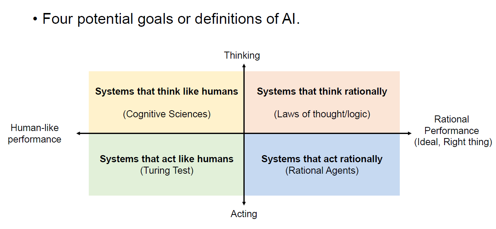
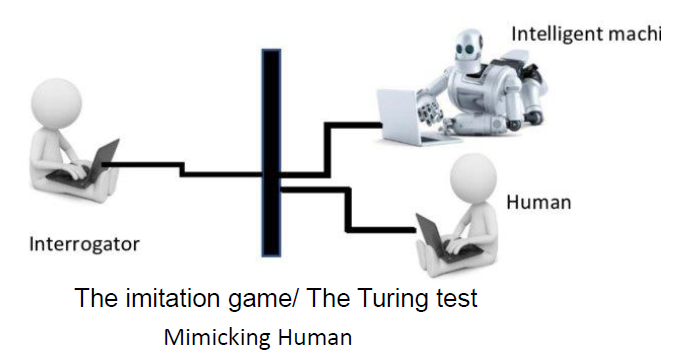
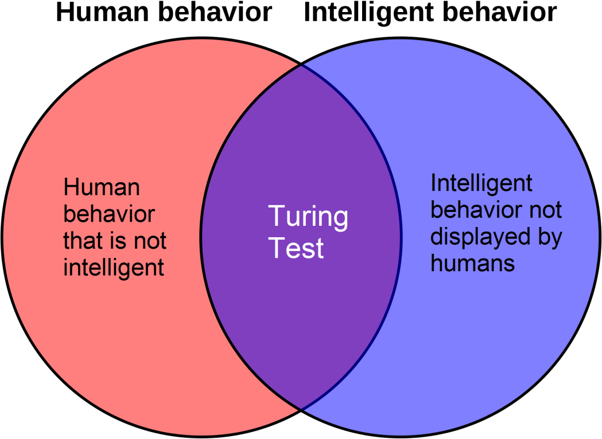

# **Introduction to Artificial Intelligence**

## What is AI?

AI is concerned with understanding and building intelligent entities—machines that can compute how to act effectively and safely in a wide variety of novel situations.

### 1. Acting Humanly: The Turing Test Approach 

The Turing Test, proposed by the British mathematician and computer scientist Alan Turing in 1950, is a test of a machine's ability to exhibit intelligent behavior indistinguishable from that of a human. The test involves three participants: a human judge, a human participant, and a machine. The judge engages in a conversation with both the human and the machine, typically through a text interface to avoid bias based on physical appearance or voice. If the judge cannot reliably tell which participant is the machine, then the machine is said to have passed the test.

#### Pitfalls of the Turing Test

- **Doesn't Really Indicate if the Machine has Intelligence**:
  - Passing the Turing Test does not necessarily mean that a machine possesses true understanding or consciousness. It only shows that the machine can simulate human-like responses.
- **Mimicking Human Behavior Does Not Make Machines Intelligent**:
  - A machine could be programmed with extensive databases of human responses and sophisticated algorithms to mimic conversation without any genuine understanding or cognitive processes. This superficial imitation can be mistaken for intelligence.
- **Human Intelligence is Not the Only Form of Intelligence**:
  - The Turing Test is anthropocentric, focusing solely on human-like intelligence. There could be other forms of intelligence (e.g., animal, alien, or machine-specific) that the test does not account for. It overlooks the possibility that a machine could exhibit intelligence in ways fundamentally different from human behavior.

To pass the Turing Test, a machine needs the following capabilities:

- **Natural language processing**: To communicate successfully in a human language.
- **Knowledge representation**: To store what it knows or hears.
- **Automated reasoning**: To answer questions and draw new conclusions.
- **Machine learning**: To adapt to new circumstances and detect patterns.

While Turing viewed the physical simulation of a person as unnecessary for demonstrating intelligence, other researchers have proposed a total Turing Test. This test requires interaction with objects and people in the real world. To pass the total Turing Test, a robot would need:

- **Computer vision**: To perceive the world.
- **Speech recognition**: To understand spoken language.
- **Robotics**: To manipulate objects and move around.

### 2. Thinking Humanly: The Cognitive Modeling Approach

To assert that a program thinks like a human, we must understand how humans think. This can be achieved through:

- **Introspection**: Observing our own thoughts as they occur.
- **Psychological experiments**: Observing a person in action.
- **Brain imaging**: Observing the brain in action.

Once we have a sufficiently precise theory of the mind, we can express it as a computer program. If the program's input-output behavior matches that of a human, it suggests that some of the program's mechanisms could be operating in humans.

### 3. Thinking Rationally: The “Laws of Thought” Approach

This approach focuses on ideal or correct reasoning processes, often based on logic. For example:

- **Socrates is a man; all men are mortal; therefore, Socrates is mortal.**

#### Problems with This Approach

- **Difficult to formalize informal knowledge**: Translating everyday knowledge into formal logical terms is challenging.
- **Computationally intensive**: Even problems with a few dozen facts can overwhelm a computer unless guided on which reasoning steps to prioritize.

### Acting Rationally: The Rational Agent Approach

#### Key Concepts:

1. **Agent Definition**:
   - An **agent** is an entity that perceives its environment and acts upon it.
2. **Computer Agents**:
   - Expected capabilities:
     - **Operate autonomously**: They function without constant human intervention.
     - **Perceive their environment**: They gather data from their surroundings.
     - **Persist over a prolonged time period**: They continue to function and achieve objectives over time.
     - **Adapt to change**: They adjust their behavior in response to changes in their environment.
     - **Create and pursue goals**: They set objectives and work towards achieving them.
3. **Rational Agent**:
   - A **rational agent** acts to achieve the best possible outcome, or the best-expected outcome when there is uncertainty.
   - **Rationality** involves making decisions that are expected to yield the most favorable results based on the given objectives.
4. **Focus of AI on Rational Agents**:
   - AI research and development have concentrated on creating agents that perform actions deemed "right" based on their defined objectives.
   - The "right thing" is determined by the goals or objectives provided to the agent.
5. **General Principles and Components**:
   - This area of study focuses on the fundamental principles that guide rational agents and the necessary components to construct them.
6. **Limited Rationality**:
   - **Perfect rationality** is often unattainable in complex environments due to the high computational demands.
   - **Limited rationality** acknowledges that while agents strive for the best possible outcomes, practical constraints often limit their ability to achieve perfect rationality.

### Summary:

The rational agent approach in AI involves developing entities that can autonomously perceive their environment, adapt to changes, and act towards achieving defined objectives. While AI strives to create rational agents that make the best possible decisions, practical limitations often necessitate a balance between ideal rationality and feasible computation.