# 				<u>Agents</u>

# 1. *What is an Agent?*

#### Definition:

- An **agent** is "anything" that can perceive its environment through sensors and acts upon the environment through actuators.

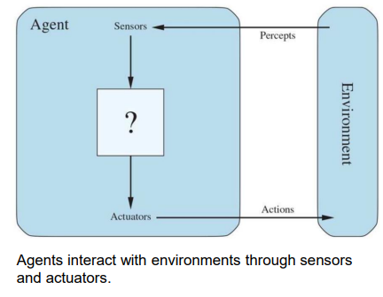

#### Key Components:

1. **Sensors**: Devices or mechanisms that allow the agent to perceive or gather information from its environment.
2. **Actuators**: Components that enable the agent to act upon or influence the environment based on the information gathered.

#### Examples and Analogies:

1. **Human**:
   - **Sensors**: Eyes, ears, skin, etc., which allow humans to see, hear, feel, and perceive their surroundings.
   - **Actuators**: Muscles and limbs that enable humans to move, speak, and interact with their environment.
2. **Cleaning Robot**:
   - **Sensors**: Cameras, infrared sensors, bump sensors, etc., to detect obstacles, dirt, and navigate the space.
   - **Actuators**: Wheels, brushes, suction mechanisms, etc., to move around and clean the floor.
3. **Software Agents**:
   - **Sensors**: APIs, data inputs, web scrapers, etc., to gather information from digital environments (e.g., the internet, databases).
   - **Actuators**: Algorithms, scripts, network requests, etc., to perform tasks like data processing, sending emails, or interacting with other software systems.

------

# 2. *The Agent Function*

#### Key Concepts:

1. **Agent Function**:
   - **Definition**: The agent function maps the agent’s percept sequence to an action.
   - **Percept Sequence**: The complete history of everything an agent has perceived so far.
   - **Ideal Mapping**: Specifies the actions an agent should take for any given percept sequence.
2. **Agent Program**:
   - **Definition**: The implementation of the agent function.
   - The agent program is the software or code that dictates how the agent behaves based on its percept sequence.
3. **Performance Measure**:
   - **Definition**: The effectiveness of the agent function is evaluated using a performance measure.
   - **Purpose**: It quantifies how well the agent is performing with respect to the goals or objectives it is designed to achieve.

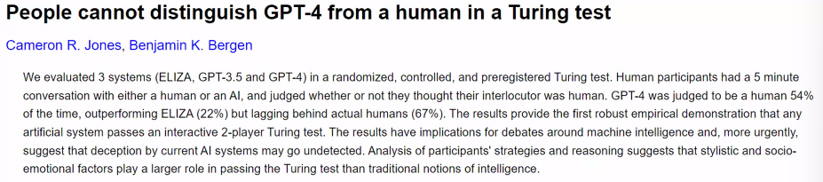

------

# 3. *Good Behavior: The Concept of Rationality*

## <u>Rational Agent ?</u>

- **Definition**: A rational agent is one that does the right thing.
- Determining the Right Thing:
  - **Performance Measure**: A criterion that evaluates the success of the agent's actions.
  - **Percept Sequence**: The complete history of what the agent has perceived up to the current moment.
  - **Knowledge of the Environment**: Information the agent has about its surroundings.
  - **Available Actions**: The set of actions the agent can perform.

## <u>Performance Measures</u> :

1. **Consequentialism**:
   - **Definition**: Evaluating an agent’s behavior based on the consequences of its actions.
   - **Purpose**: To assess how successful the agent's actions are in achieving its goals.
2. **Examples**:
   - Cleaning Robot :
     - **Performance Criterion**: The cleanliness of the floor.
     - Points System :
       - Award points for each clean square at each time step.
       - Deduct points for electricity consumed and noise generated.
     - **Objective**: The robot should take actions that maximize its overall points.
3. **Designing Performance Measures**:
   - **Focus on Desired Outcomes**: Design performance measures based on the desired state of the environment, not on preconceived notions of how the agent should act.
   - **Objective-Based**: Ensure that the performance measure aligns with the actual goals of the agent’s operation.

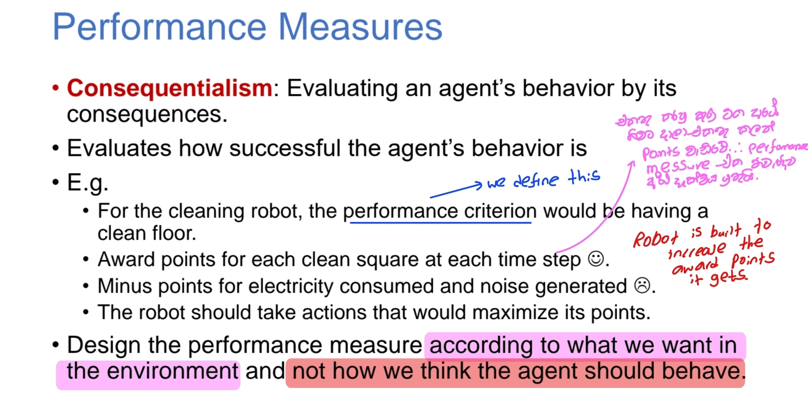

------

## <u>Definition of Rational Agent</u>

#### Key Concepts :

1. **Rational Agent**:
   - <mark>For each possible percept sequence, a rational agent selects an action expected to maximize its performance measure.The choice is based on the evidence provided by the percept sequence and the built-in knowledge of the agent.</mark>
2. **Example **:
   - Crossing the Road:
     - An agent that can only look sideways checks that the road is clear before crossing.
     - If something falls from above and crushes the agent, it is still considered rational.
     - **Reason**: The agent acted based on its perceptual capabilities and available knowledge, which did not include the ability to look up.

#### Rational Agent Example : Vacuum-Cleaner Agent

###### Performance Measure:

- Awards one point for each clean square at each time step over a lifetime of 1000-time steps.

###### Environment:

- **Geography**: Known beforehand.
- **Dirt Distribution and Initial Location**: Unknown.
- **Behavior of Clean Squares**: They remain clean after being cleaned.

###### Actions:

- **Right (Move Right)**: Moves the agent one square to the right unless it is at the boundary.
- **Left (Move Left)**: Moves the agent one square to the left unless it is at the boundary.
- **Suck (Clean)**: Cleans the current square if it contains dirt.

###### Perception:

- The agent correctly perceives its current location and whether that location contains dirt.

## <u>Building Rational Agents</u>

#### Key Concepts:

1. **AI and Rational Agents**:
   - **Objective**: AI focuses on building rational agents that always do the right thing.
2. **Types of Rationality**:
   - Perfect Rationality :
     - Assumes the agent has complete knowledge of everything.
     - Always takes the action that maximizes its utility.
   - Bounded Rationality :
     - Proposed by Herbert Simon in 1958.
     - Agents are limited by the information they have.
     - Use approximate methods to handle tasks, similar to how the human mind operates.

#### Rationality:

1. **Rational Action**:
   - <mark>The action that maximizes the expected value of the performance measure given the percept sequence to date</mark>.
2. **Questions About Rational Action**:
   - Is it the best action? :
     - `Rational action is considered the best given the information available to the agent at the time of the decision`.
   - Is it optimal? :
     - `Rational action is not always optimal in the sense of perfect rationality. It is optimal within the bounds of the agent's knowledge and computational limits.`

------

## <u>Omniscience, Learning, and Autonomy in AI</u>

- **Omniscience**
  
  - The agent knows the actual outcome of its actions and acts accordingly.
  - Ideal but not practically achievable; complete knowledge is often unrealizable.
  
  **Rationality**
  
  - The agent maximizes expected outcomes based on available information.
  - Decision-making depends on the percept sequence to date, not requiring omniscience.
  - This requires a rational agent to:
    - Gather information
    - Learn from perceptions
  
  **Autonomy**
  
  - More Autonomous:
    - Agent's actions rely on learning from its own experiences gathered through sensors.
  - Less Autonomous:
    - Agent's actions depend more on knowledge of the environment provided by designers.
  

------

# 4. *The Task Environment*

## Task Environment Components

1. **Defines the problems to which the rational agents attempt to provide solutions:**
   - <mark>The task environment specifies the goals or problems that the agents are designed to address</mark>. This could include tasks like navigating a maze, playing chess, or interpreting natural language.
2. **Consists of PEAS:**
   - PEAS stands for:
     - **Performance Measure:** Defines what constitutes success in the task. It's the criteria used to evaluate the agent's performance.
     - **Environment:** Describes the context or setting in which the agent operates, including physical aspects and other entities present.
     - **Actuators:** Specifies how the agent interacts with the environment, such as motors or outputs for performing actions.
     - **Sensors:** How the agent perceives or gathers information from its environment, such as cameras, microphones, or other sensors.

### Designing an Agent

- Specifying the task environment fully:

   This involves detailing each component of PEAS:

  - **Performance Measure:** Clearly define what the agent is supposed to achieve or optimize.
  - **Environment:** Describe the conditions, entities, and constraints in which the agent operates.
  - **Actuators:** Specify the mechanisms or methods through which the agent can affect the environment.
  - **Sensors:** Outline how the agent perceives or gathers information from its environment to make decisions.

  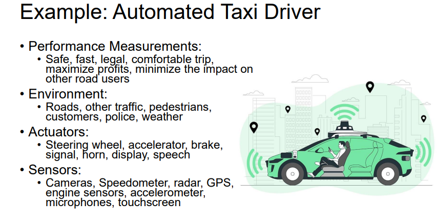

## Importance of Task Environment Specification

- **Foundation for agent design:** By thoroughly defining the task environment, you provide the foundational requirements and constraints that guide the design of the agent. This ensures that the agent is appropriately equipped to achieve its objectives effectively.

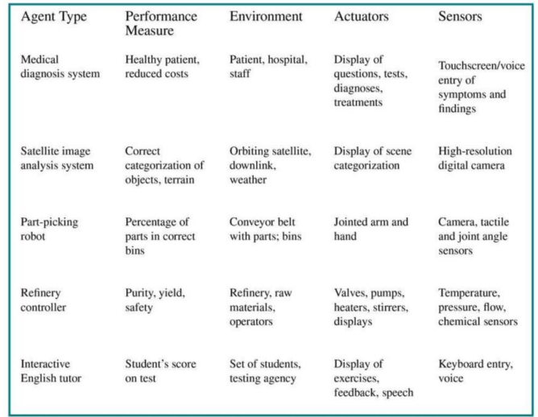

------

## Properties of Task Environments

Observed from the agent's point of View.

### **1. Fully Observable vs. Partially Observable:**

- <mark>Fully Observable</mark>: The agent's sensors provide complete access to the environment's state at any given time.

  - Fully observable environments are convenient. 

- <mark>Partially Observable</mark>: The agent's sensors may provide incomplete or noisy information about the environment's state.

  - Example:
    -  A vacuum cleaner with a local dirt sensor can't perceive dirt in other rooms.
    -  A vacuum agent with only a local dirt sensor cannot tell whether there is dirt in  other squares. 
    -  An automated taxi cannot see what other drivers are thinking.

- 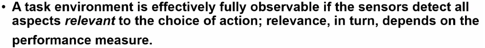

  
  

### **2. Single-Agent vs. Multi-Agent:**

- <mark>Single-Agent</mark>:

   An environment where there is only one agent affecting the state.

  - Example: A crossword puzzle solver.

- <mark>Multi-Agent</mark>:

   Multiple agents interact within the environment, affecting each other's states.

  - Example: Agents playing a game of chess where each agent's moves impact the overall state.

- 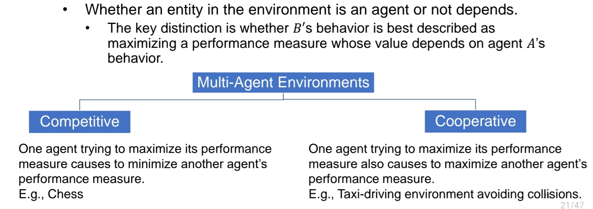

### **3. Deterministic vs. Nondeterministic vs. Stochastic:**

- <mark>Deterministic</mark>:

  The next state of the environment is completely determined by the current state and actions taken. There is no randomness involved.` Given the same initial conditions, a deterministic system will always produce the same result`.

  - Example: Simple physical systems with known rules / Chess

- <mark>Nondeterministic</mark>:

  The next state may not be fully determined by the current state and actions due to randomness or unknown factors.

  - Example: Taxi driving where traffic conditions can vary unpredictably.

- <mark>Stochastic</mark>:

   Environment changes explicitly incorporate probabilities.

  - Example: Weather forecasting where the chance of rain is stated as a probability.
  
  - > **Deterministic** and **Nondeterministic** describe different types of systems or processes based on the predictability of their outcomes:
    >
    > ### **Deterministic**:
    >
    > - **Predictability**: The outcome is entirely predictable.
    > - **Definition**: In a deterministic system, given the current state and the actions taken, the next state is fully determined with no randomness involved. If you repeat the process with the same initial conditions, you will always get the same result.
    > - **Example**: A simple calculator performing addition. If you input `2 + 3`, it will always output `5`, regardless of how many times you perform the operation.
    >
    > ### **Nondeterministic**:
    >
    > - **Unpredictability**: The outcome may vary even with the same initial conditions.
    > - **Definition**: In a nondeterministic system, the next state is not fully determined by the current state and actions. There may be randomness, unknown factors, or multiple possible outcomes for the same initial conditions.
    > - **Example**: A taxi ride in a city. Even if you start from the same location and follow the same route, the time it takes to reach your destination can vary due to traffic conditions, roadblocks, or other unpredictable factors.

### **4. Episodic vs. Sequential:**

- <mark>Episodic</mark>: One action is not influenced to the next action

   Each interaction or episode is self-contained and independent of previous episodes.

  - Example: Inspecting items on an assembly line where each inspection is isolated.

- <mark>Sequential</mark>:

   Actions and decisions in the current episode affect future episodes.

  - Example: Chess, where each move influences subsequent moves.
  
  > ### **Deterministic**:
  >
  > - **Focus**: The predictability of the outcome.
  > - **Definition**: A system is deterministic if the next state is entirely determined by the current state and the actions taken, with no randomness involved. If you know the current state and the actions, you can predict the next state with certainty.
  > - **Example**: A simple mathematical function like `f(x) = 2x` is deterministic. Given the same input `x`, it will always produce the same output.
  >
  > ### **Sequential**:
  >
  > - **Focus**: The dependency of current actions on previous actions.
  > - **Definition**: A sequential system is one where the current action affects future states or outcomes. In other words, the decisions or actions in one step have consequences that influence what happens next.
  > - **Example**: Playing chess is sequential because each move you make affects the future possibilities and strategies in the game.
  >
  > ### **Key Difference**:
  >
  > - **Deterministic** refers to the certainty of outcomes based on current conditions and actions, with no randomness.
  > - **Sequential** refers to the dependency of actions, where what happens now influences what happens next.

### **5. Dynamic vs. Static:**

- <mark>Dynamic</mark>:

   The environment can change while the agent is making decisions.

  - Example: Real-time strategy games where opponents' moves affect the game state. / Taxi driving

- <mark>Static</mark>:

   The environment remains unchanged while the agent deliberates.

  - Example: Solving static puzzles like crossword puzzles.

### **6. Discrete vs. Continuous:**

- <mark>Discrete</mark>:

   States, time, percepts, and actions are clearly defined and discrete.

  - Example: Chess, where moves are discrete and finite.

- <mark>Continuous</mark>:

   States, time, percepts, and actions exist on a continuous scale.

  - Example: Taxi driving, where movements and actions are continuous in both space and time.

These properties help in categorizing and understanding different types of environments agents may operate in, guiding how agents are designed and how they interact effectively within their environments.

##### examples

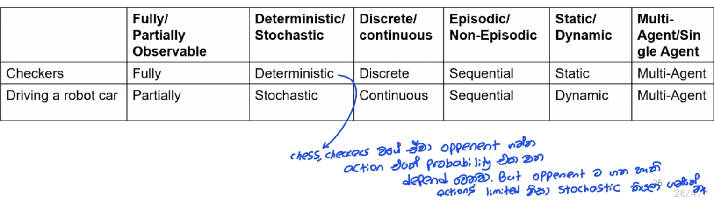

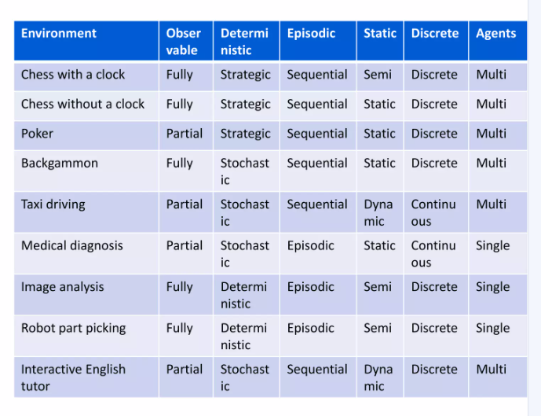

#### Summary

| Property                         | Description                                                  | Examples                                                     |
| -------------------------------- | ------------------------------------------------------------ | ------------------------------------------------------------ |
| **Observability**                | Fully Observable: Agent's sensors provide complete state information. Partially Observable: Agent's sensors provide incomplete or noisy state information. | Vacuum cleaner (local dirt sensor) vs. automated taxi (traffic conditions). |
| **Single-Agent vs. Multi-Agent** | Single-Agent: Only one agent affecting the environment. Multi-Agent: Multiple agents interacting, influencing each other's states. | Crossword puzzle solver vs. chess players.                   |
| **Determinism**                  | Deterministic: Next state determined by current state and actions. Nondeterministic: Next state may not be fully determined by current state and actions. | Simple physics simulation vs. taxi driving (traffic unpredictability). |
| **Stochasticity**                | Deterministic: No probabilities involved. Stochastic: Environment changes involve explicit probabilities. | Weather forecasting (probability of rain) vs. deterministic processes. |
| **Episodic vs. Sequential**      | Episodic: Actions and experiences are isolated episodes. Sequential: Actions affect subsequent actions and outcomes. | Inspecting items on an assembly line vs. playing chess.      |
| **Dynamic vs. Static**           | Dynamic: Environment can change while agent makes decisions. Static: Environment remains unchanged while agent deliberates. | Real-time strategy games vs. crossword puzzles.              |
| **Discrete vs. Continuous**      | Discrete: States, time, percepts, and actions are clearly defined and finite. Continuous: States, time, percepts, and actions exist on a continuous scale. | Chess (discrete moves) vs. taxi driving (continuous movement). |

------

# 5.*The structure of Agents*

1. **Agent Program:**
   - The agent program is responsible for determining the actions of the agent based on its percepts.
   - It implements the agent function, which is essentially a mapping from percepts (the inputs the agent receives from its environment) to actions (the outputs or responses the agent performs).
   - The agent program can be thought of as the "brain" of the agent, containing the logic and decision-making processes.
2. **Agent Architecture:**
   - The agent architecture refers to the physical or virtual computing device on which the agent program runs.
   - It includes sensors and actuators, which are the mechanisms through which the agent interacts with its environment.
     - **Sensors**: Devices that gather information from the environment and provide percepts to the agent program.
     - **Actuators**: Devices that carry out the actions decided by the agent program.
   - The architecture ensures that percepts from the sensors are made available to the agent program, runs the program, and sends the program’s action choices to the actuators.

In summary, an agent can be defined by the combination of its architecture and program:
$$
Agent=Architecture+Program
$$
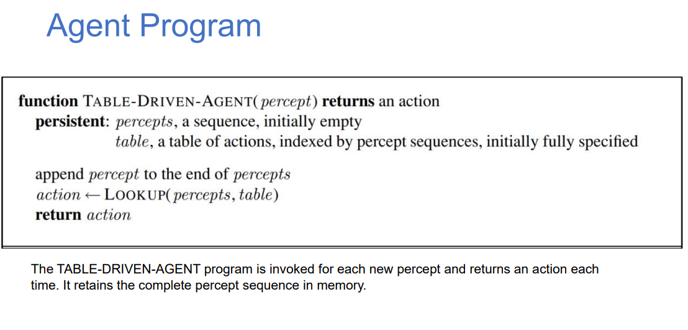

# 6.*Agent program types*

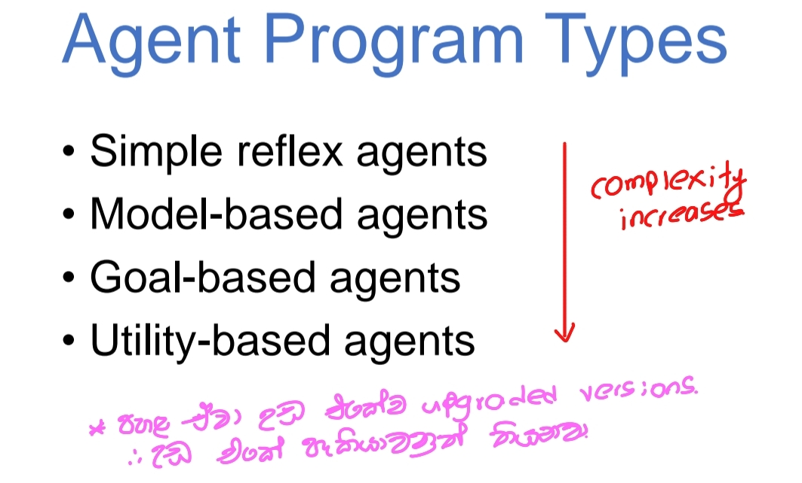

## <u>1.Simple Reflex Agents</u>

Simple reflex agents act solely based on the current percept, ignoring the rest of the percept history. **<u>They select actions based on a condition-action rule (if-then rules)</u>**, making them the simplest form of agents.

**Characteristics:**

- React to the environment without considering the past.
- Use condition-action rules to determine the action.
- Suitable for simple environments with well-defined rules.

Problems with Simple reflex agents are : 

- Very limited intelligence.
- No knowledge of non-perceptual parts of the state.
- Usually too big to generate and store.
- If there occurs any change in the environment, then the collection of rules needs to be updated.

**Example:** A thermostat that turns on the heater if the temperature drops below a certain threshold.

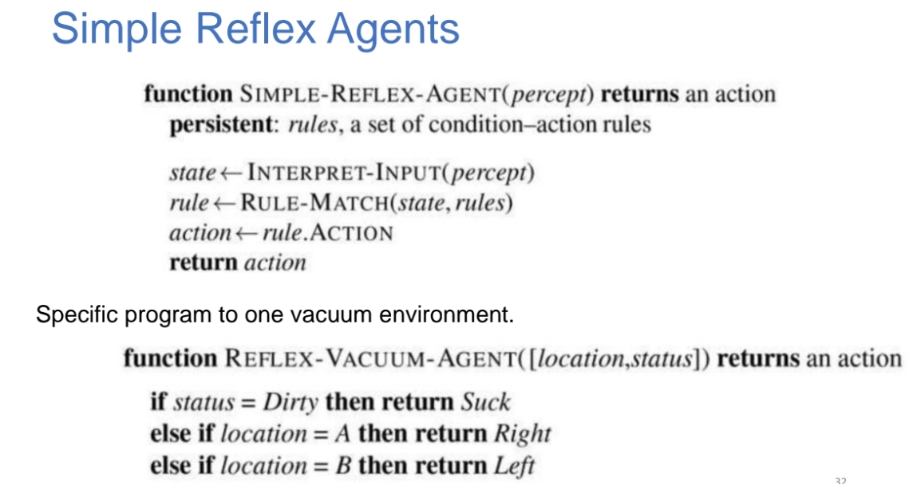

​											*Simple Reflex Agents*

## <u>2.</u><u>Model based Reflex Agents</u>

Model-based reflex agents maintain an internal state to make decisions based on the history of their percepts. This internal state is essential for operating in partially observable environments, where not all necessary information is available at any given time.

<u>Key Features</u>

1. **Maintains an Internal State**:
   - **Depends on Percept History**: The internal state is updated based on the agent's percepts over time.
   - `Useful in Partially Observable Environments`: Helps the agent keep track of information that is not immediately perceptible.
2. **Tracks Perception History**:
   - The agent records the history of its perceptions to inform future actions.
3. **Examples**:
   - **Crossing the Road**: When an agent needs to cross the road, it will look right and then left. While looking left, it remembers what it saw on the right.
   - **Applying Brakes**: When the vehicle in front brakes, the agent applies brakes based on the previous frame from the camera.
   - **Changing Lanes**: The agent keeps track of where other cars are to make safe lane changes.

<u>Maintaining the Internal State</u>

To maintain the internal state, the agent needs to store <u>two kinds of knowledge</u>:

1. <mark>**Transition Model of the World**: **How the World Works**</mark>

   ​	*1.**<u>Effects of the Agent’s Actions</u>***: Understanding how the agent's actions affect the world.

   ​			When the agent turns the steering wheel clockwise,the car turns to the right

   ​	*2.**<u>World Evolution</u>***: Knowledge of how the world changes independently of the agent’s actions.

   ​			When it's raining , the car's cameras can get wet

2. <mark>**Sensor Model**:</mark>

   **Reflecting World State in Percepts**: Understanding how the state of the world is represented in the agent’s sensors.

   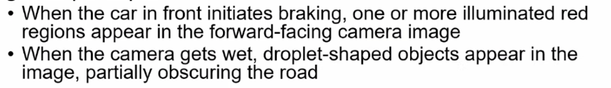

<u>How to Maintain the Internal State</u>

1. **Update Mechanism**:
   - **Observe**: The agent receives a percept from the environment.
   - **Update State**: The agent updates its internal state based on the new percept and its transition model.
   - **Decision Making**: The agent uses its updated internal state to decide the next action.
2. **Example Process** in Crossing the Road:
   1. **Look Right**: The agent observes the right side.
   2. **Update State**: It updates its internal state with the information about the right side.
   3. **Look Left**: The agent then observes the left side.
   4. **Update State**: It combines this new information with the previously stored information about the right side to decide when it is safe to cross.
3. **Example Process in Vehicles**:
   - Applying Brakes:
     1. **Observe**: The agent perceives that the vehicle in front is braking.
     2. **Update State**: It updates its internal state with this information.
     3. **Decide**: Based on the internal state, the agent decides to apply brakes.
   - Changing Lanes:
     1. **Observe**: The agent perceives the positions of surrounding cars.
     2. **Update State**: It updates its internal state with this spatial information.
     3. **Decide**: The agent uses this updated state to decide whether it is safe to change lanes.

​									*Model-Based Reflex Agents*

------

## <u>3.Goal based Agents</u>

Goal-based agents act to achieve specific goals. <u>They use the internal state to make decisions that move them closer to their goals</u>. These agents consider the future consequences of their actions, leading to more complex behaviors than reflex agents.

**Characteristics:**

- Act to achieve defined goals.
- Use search and planning to decide on actions.
- Can handle more complex environments and objectives.
- More flexible than reflex agents
  • Changing the goal will change the actions appropriately. E.g., Robot Taxi drive

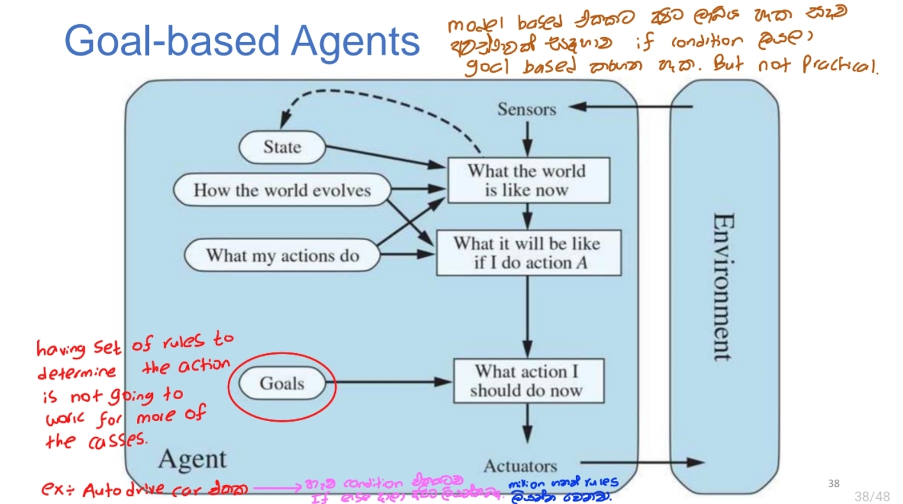

**Example:** 1. A chess-playing program that decides its moves based on the goal of checkmating the opponent.

​		 2. Robot car • Goal: Customers Destination (Say Ratmalana) 

​				• Actions: at a junction, turn left/right/go straight

## <u>4.Utillity based Agents</u>

1. **Utility Function:**

   - A utility function is a mathematical representation that maps a state or a sequence of states onto a real number, indicating the degree of happiness or satisfaction associated with those states.
   - This function helps the agent evaluate different potential outcomes or states, allowing it to choose the most desirable one.

2. **Degree of Happiness:**

   - The utility function quantifies how desirable a particular state is, describing the degree of happiness or satisfaction the agent derives from that state.

   - Higher utility values represent more preferred states, guiding the agent toward decisions that maximize its overall happiness or satisfaction.

     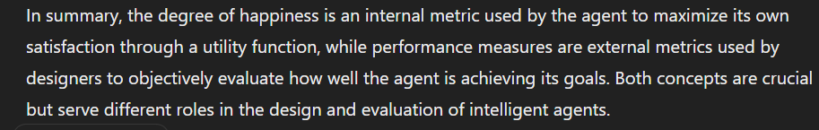

3. **Use Cases:**

   - Utility functions are particularly useful in situations where simple goal-based approaches are inadequate.
   - They help in scenarios where there are multiple conflicting goals or where a single goal does not sufficiently capture the agent’s objectives.

4. **Handling Conflicting Goals:**

   - In real-world applications, agents often face conflicting goals. 

   - > `For example, a taxi driver must balance speed and safety.`-meh state through yaddi kochchr happyda balala happy wadima eka thoranawa

   - The utility function allows the agent to specify a tradeoff between these conflicting goals, enabling it to make decisions that appropriately balance these competing interests.

5. **Choosing the Best Fit:**

   - Utility-based agents are designed to choose the best fit out of many options by evaluating the utility of each option.
   - For instance, a taxi driver might have multiple routes or actions available to reach the same destination. The utility function helps determine which route is the best based on factors like time, safety, fuel efficiency, and customer satisfaction.

Example: Taxi Driver

A utility-based agent in the context of a taxi driver would work as follows:

- **Multiple Routes/Actions:** The taxi driver has several possible routes to take to reach a destination.
- **Utility Evaluation:** Each route is evaluated based on a utility function that considers factors such as travel time, traffic conditions, safety, and passenger comfort.
- **Best Decision:** The route with the highest utility value is chosen, ensuring that the driver takes the most efficient and satisfactory path given the current conditions and priorities.

​										*Utility-Based Agents*

## <u>5.Learning Agents</u>

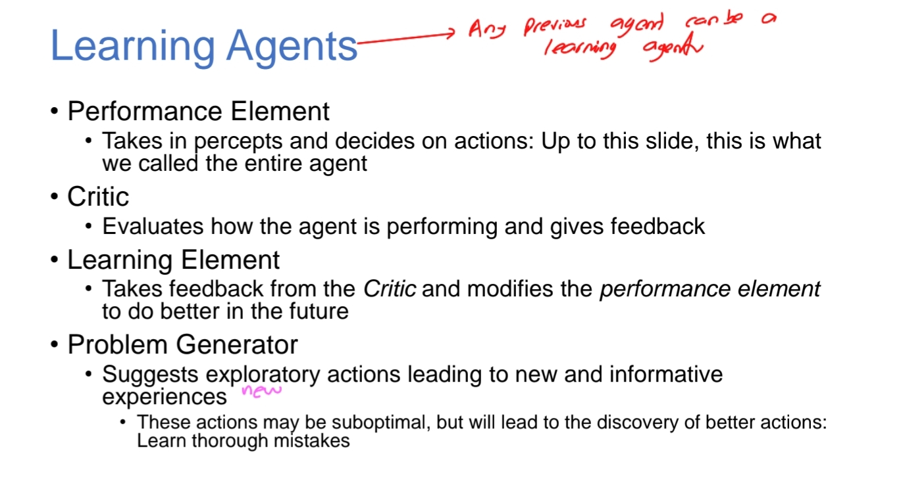

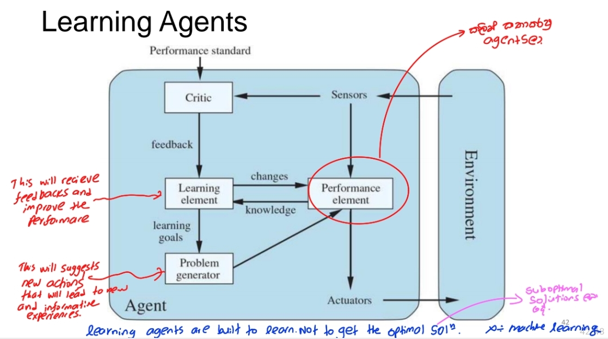

------

# 7.*Components of Agent Programs  Work*

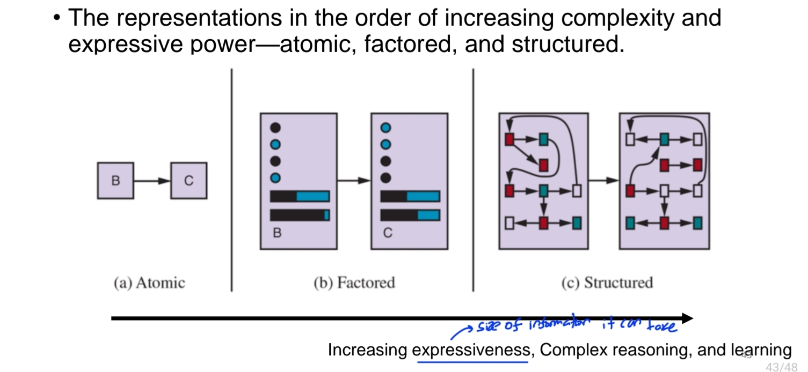

<mark>Agent programs vary in <u>complexity and expressive power</u> depending on the type of representation they use. These representations can be broadly categorized as atomic, factored, and structured. Here’s an overview of each type:</mark>

#### <u>1. Atomic Representation</u>

**Definition:**

- The simplest form of representation where each state of the world is treated as a unique, indivisible entity.

**Components:**

- **States:** Represented as atomic symbols with no internal structure.
- **Actions:** Defined as transitions between states.
- **Percepts:** Mapped directly to states without any internal detail.

**Advantages:**

- Simplicity and ease of implementation.
- Suitable for small problem spaces where states and actions are limited.

**Disadvantages:**

- Lack of detail and expressiveness.
- Scalability issues as the number of states increases exponentially with complexity.

**Example:**

- In a maze-solving agent, each position in the maze might be represented as an atomic state.

#### <u>2. Factored Representation</u>

**Definition:**

- States are represented as a collection of variables, each with its own value, allowing for more detailed and nuanced descriptions of the world.

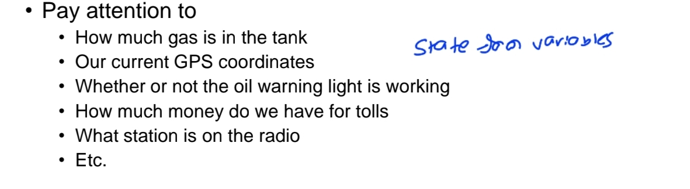

- Two different factored states can share some attributes. ( such as being at some GPS location)

**Components:**

- **States:** Defined by a set of variables (factors) and their values.
- **Actions:** Defined as operations that change the values of the state variables.
- **Percepts:** Provide information about the values of specific variables.

**Advantages:**

- More expressive than atomic representations.
- Easier to manage and manipulate states as the number of variables increases.

**Disadvantages:**

- Increased complexity compared to atomic representations.
- May still be challenging to handle very large state spaces.

**Example:**

- In a robotic vacuum cleaner, the state could be represented by variables such as position, battery level, and dirt detection.

#### <u>3. Structured Representation</u>

**Definition:**

- The most complex form, where states and actions are represented using relational or logical structures, allowing for detailed descriptions and reasoning about the world.

**Components:**

- **States:** Represented using structured objects, relations, and functions.
- **Actions:** Defined in terms of changes to the relationships between objects.
- **Percepts:** Provide detailed information about objects and their relationships.

**Advantages:**

- Highly expressive, capable of capturing complex relationships and dependencies.
- Suitable for sophisticated reasoning and problem-solving tasks.

**Disadvantages:**

- High computational complexity.
- Requires advanced algorithms for processing and reasoning.

**Example:**

- In an autonomous car, the state could be represented by a detailed map with objects like other vehicles, pedestrians, and traffic signals, along with their relationships and interactions.

### Summary Table

| **Aspect**            | **Atomic Representation**                       | **Factored Representation**                              | **Structured Representation**                             |
| --------------------- | ----------------------------------------------- | -------------------------------------------------------- | --------------------------------------------------------- |
| **Definition**        | States as unique, indivisible entities          | States as sets of variables with values                  | States as structured objects and relations                |
| **State Complexity**  | Simple, indivisible                             | Moderately complex, with variable values                 | Highly complex, with detailed structures and relations    |
| **Action Definition** | Transitions between atomic states               | Operations changing variable values                      | Changes to relationships between structured objects       |
| **Percept Handling**  | Direct mapping to states                        | Information about variable values                        | Detailed information about objects and relations          |
| **Advantages**        | Simplicity, ease of implementation              | More expressive, manageable variable states              | Highly expressive, suitable for complex reasoning         |
| **Disadvantages**     | Limited detail, scalability issues              | Increased complexity, still challenging for large states | High computational complexity, advanced algorithms needed |
| **Example**           | Maze-solving agent (positions as atomic states) | Robotic vacuum cleaner (position, battery, dirt)         | Autonomous car (map with vehicles, pedestrians)           |

These different levels of representation allow agents to handle a wide range of complexities and expressiveness in their environments, from simple tasks with limited state spaces to complex scenarios requiring sophisticated reasoning.
