# <u>Searching</u>


### Problem-Solving Agent

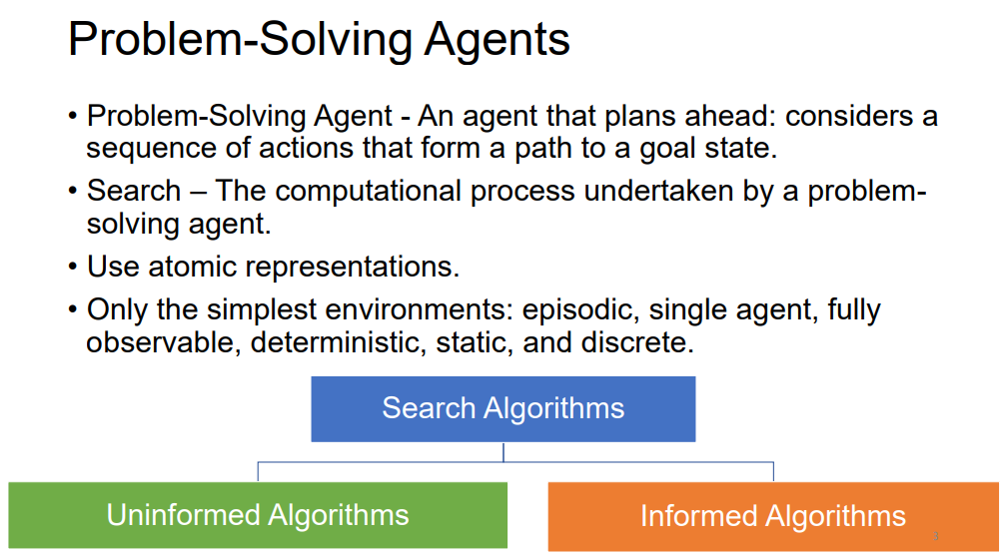

> `we only talk about searching algorithms with simple environments in this module`
>
> ### Characteristics of Simple Environments
>
> - **Episodic**: Each action or decision made by the agent is independent of previous actions.
> - **Single Agent**: There is only one agent interacting with the environment.
> - **Fully Observable**: The agent has complete information about the environment at any given time.
> - **Deterministic**: The outcome of each action is certain, with no randomness involved.
> - **Static**: The environment does not change while the agent is deliberating.
> - **Discrete**: The states and actions are distinct and countable.

### Search Algorithms

Search algorithms are divided into two main categories based on whether or not they use domain-specific knowledge to guide the search:

1. **Uninformed (Blind) Search Algorithms**:
   - **Definition**: These algorithms do not have any additional information about the goal other than the problem definition. They explore the search space without any guidance or heuristic.
   - Examples:
     - <mark>**Breadth-First Search (BFS)**</mark>: Explores all nodes at the present depth level before moving on to nodes at the next depth level.
     - <mark>**Depth-First Search (DFS)**</mark>: Explores as far down a branch as possible before backtracking.
     - <mark>**Uniform-Cost Search** (**Dijkstra**)</mark> : Expands the least-cost node, useful when path costs vary.
2. **Informed (Heuristic) Search Algorithms**:
   - **Definition**: These algorithms use problem-specific knowledge (heuristics) to find solutions more efficiently than uninformed search methods. Heuristics provide an estimate of the cost from the current state to the goal, guiding the search towards more promising paths.
   - Examples:
     - <mark>**Greedy Best-First Search**</mark>: Selects the path that appears to be closest to the goal based on a heuristic.
     - <mark>**A\* Search**</mark>: Combines the cost to reach the current node and the estimated cost to reach the goal, balancing exploration and exploitation.

------

## The problem solving process

> ### 1. GOAL FORMULATION
>
> - **Purpose**: Goal formulation is the first step where the agent defines what it wants to achieve.
> - **Details**: Goals help to organize the agent's behavior by narrowing down the set of possible actions it should consider. By having a clear goal, the agent can focus its efforts on actions that are relevant to achieving that goal.
> - **Example**: If the agent is a robot in a maze, the goal might be to reach the exit. This goal limits the robot to consider only actions that move it toward the exit.
>
> ### 2. PROBLEM FORMULATION
>
> - **Purpose**: In this step, the agent creates a detailed description of the problem it needs to solve in order to reach the goal.
> - **Details**: The problem formulation includes defining the possible states of the environment, the actions available to the agent, and how these actions change the state. It also involves specifying the initial state and the goal state(s).
> - **Example**: For the robot in a maze, problem formulation would involve mapping out the maze, identifying the start position (initial state), and the location of the exit (goal state). The robot would also define actions like "move forward," "turn left," and "turn right."``
> - ex : states: various cities |  actions: drive between cities
>
> ### 3. SEARCH
>
> - **Purpose**: The search process involves finding a sequence of actions that will lead from the initial state to the goal state.
> - **Details**: Before the agent acts in the real world, it uses a model of the environment to simulate different sequences of actions. The agent searches through possible action sequences until it finds one that successfully leads to the goal. This sequence of actions is called a solution.
> - **Example**: The robot might simulate various paths through the maze, trying different combinations of moves until it finds one that leads to the exit.
>
> ### 4. EXECUTION
>
> - **Purpose**: After finding a solution, the agent executes the actions in the real world.
> - **Details**: The agent carries out the actions one by one, as determined by the search process, to move from the initial state to the goal state. If the environment is static and deterministic, the agent can follow the plan exactly as simulated.
> - **Example**: The robot, having found the correct path to the exit in the search phase, now physically moves through the maze, following the planned sequence of moves to reach the exit.
>
> ### Summary
>
> - **Goal Formulation**: Defines what the agent wants to achieve.
> - **Problem Formulation**: Outlines the problem by describing the states, actions, and environment.
> - **Search**: Finds the solution by simulating possible sequences of actions.
> - **Execution**: Implements the solution by performing the actions in the real environment.

## Components of a search problem

> 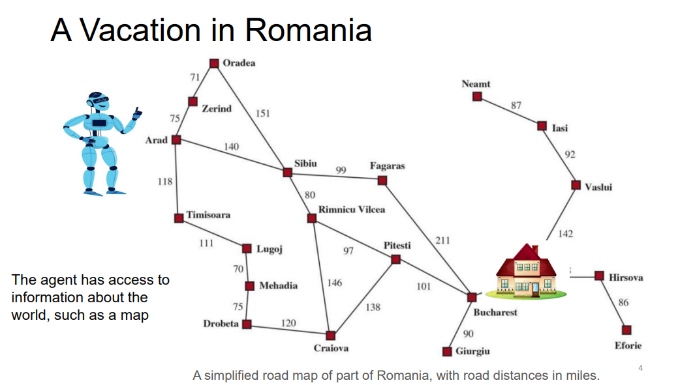
>
> ### 1. **State Space**
>
> - **Definition**: The state space is the set of all possible states that the environment can be in. Each state represents a configuration of the environment at a specific moment.
> - **Example**: In a navigation problem, the state space might include all possible locations the agent can be in.
>
> ### 2. **Initial State**
>
> - **Definition**: The initial state is the state in which the agent starts. It’s the starting point of the search process.
> - **Example**: If the agent is a car, and it starts in Arad (a city), then Arad is the initial state.
>
> ### 3. **Goal States**
>
> - **Definition**: Goal states are the states that the agent aims to reach. The problem may have one or multiple goal states.
> - Types:
>   - **Single Goal State**: There is only one state that the agent needs to reach (e.g., Bucharest).
>   - **Multiple Goal States**: The agent can achieve its objective by reaching any one of several goal states. For instance, a vacuum cleaner’s goal might be any state where all locations are clean.
> - **Generalized Goal**: Sometimes the goal is defined by a property that applies to many states.
>
> ### 4. **Actions**
>
> - **Definition**: Actions are the operations available to the agent that can change the state of the environment. Given a state s, the set of actions ACTIONS(s) returns all possible actions that can be taken in that state.
> - **Example**: In the case of a car in Arad, the available actions might be "Drive to Sibiu," "Drive to Timisoara," or "Drive to Zerind."
>
> ### 5. **Transition Model**
>
> - **Definition**: The transition model describes the result of taking an action in a given state. RESULT(s,a) returns the new state that results from performing action a in state s.
> - **Example**: If the car is in Arad and takes the action "Drive to Zerind," the resulting state would be Zerind.
>
> ### 6. **Action Cost Function**
>
> - **Definition**: The action cost function assigns a numeric cost to performing an action in a given state to reach another state. ACTION_COST(s,a,s′) represents the cost of applying action a in state s to reach state s′.
> - **Example**: The cost could be the distance in miles or the time it takes to drive from Arad to Zerind.
>
> ### 7. **Path**
>
> - **Definition**: A path is a sequence of states connected by a sequence of actions. The path represents a possible journey from the initial state to the goal state.
>
> ### 8. **Solution**
>
> - **Definition**: A solution to the search problem is a path from the initial state to a goal state. It shows how the agent can reach its objective.
>
> ### 9. **Optimal Solution**
>
> - **Definition**: The optimal solution is the path that has the lowest cost among all possible solutions. It represents the most efficient way to reach the goal state.
>
> ### 10. **Graph Representation**
>
> - Definition: The state space can be represented as a graph where:
>   - **Vertices (Nodes)** represent the states.
>   - **Directed Edges** represent the actions that move the agent from one state to another.
> - **Example**: In a map, cities would be nodes, and roads between them would be edges.
>
> ### 11. **Model**
>
> - **Definition**: A model is an abstract mathematical description of the problem. It includes the state space, actions, transition model, and goal state(s).
> - **Example**: Formulating the problem of reaching Bucharest from any given city.
>
> ### 12. **Abstraction**
>
> - **Definition**: Abstraction involves simplifying the problem by removing unnecessary details. The goal is to create a representation that captures essential aspects of the problem while ignoring complexities that don't affect the solution.
> - **Purpose**: The right level of abstraction ensures the problem is neither too complex nor too simplified, making it easier to solve while still being relevant to the real world.
>
> 
>
> 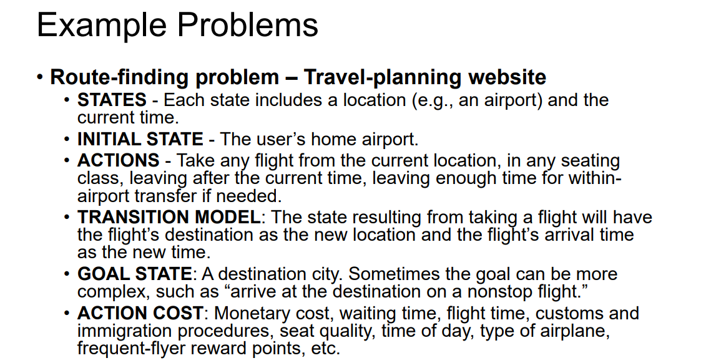

# <u>Search algorithms</u>

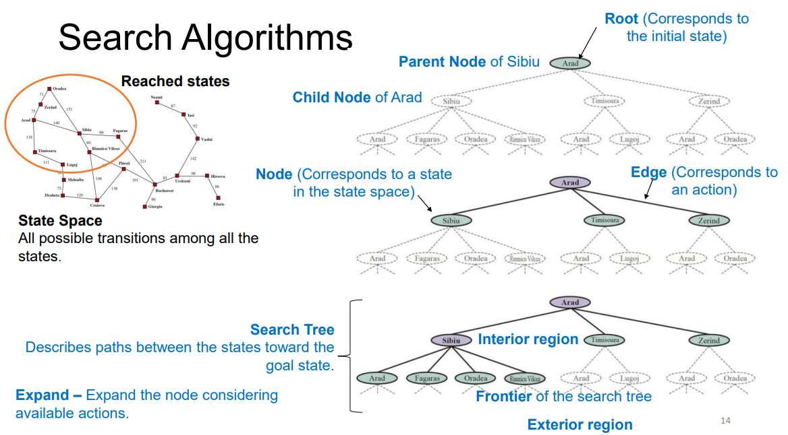

> > ### Redundant Paths `not or no longer needed`
> >
> > - **Definition**: Redundant paths occur when there are multiple ways to reach the same state, but with different costs. These paths do not add any value because they lead to the same state but take more steps or cost more resources (like time or distance).
> >
> > - **Example**: Consider the task of reaching the city of Sibiu:
> >
> >   - One path might be **Arad → Sibiu** (direct path, 140 miles).
> >   - Another path might be **Arad → Zerind → Oradea → Sibiu** (indirect path, 297 miles).
> >
> >   While both paths get you to Sibiu, the second path is much longer and therefore redundant if the goal is to find the shortest route.
> >
> > ### Repeated States
> >
> > - **Definition**: A repeated state is when the search process encounters a state that has already been visited. This often happens when exploring different branches of the search tree or graph.
> > - **Example**: If you revisit the state Sibiu through different paths, like both the direct and indirect paths mentioned above, you encounter the state Sibiu multiple times.
>
> ## measuring problem
>
> - ***Completeness*** ensures that a solution is found if one exists.
> - ***Cost Optimality*** ensures the solution is the best among all possible solutions.
> - ***Time Complexity*** measures how fast the algorithm finds a solution.
> - ***Space Complexity*** measures how much memory the algorithm uses.
>
> ### Factors Affecting Time and Space Complexity
>
> - <mark>**b (Branching Factor)**: The maximum number of successors a node can have.</mark> Higher **b** increases both time and space complexity because the algorithm needs to consider more possibilities at each level.
> - <mark>**d (Depth of the Least-Cost Solution)**: The depth at which the optimal solution is found.</mark> Deeper solutions increase the number of states the algorithm must explore, affecting time complexity.
> - <mark>**m (Maximum Path Length)**: The maximum number of actions in any path (maximum deapth).</mark> If **m** is infinite, certain search strategies may not terminate, affecting completeness and optimality.

## Informed search vs uninformed search

imagine you're in a big playground with lots of paths, and you're looking for a hidden treasure. There are two ways you can search for it:

> ### Uninformed Search
>
> This is like wandering around the playground without any clues. You don't know where the treasure is, so you just try every path, one by one, until you find it. You might start by checking the closest paths first, or you might just pick paths at random. It's like exploring without a map—you keep looking until you stumble upon the treasure!
>
> ### Informed Search
>
> Now, imagine someone gives you a map with hints that tell you which paths are more likely to have the treasure. With these clues, you don't have to wander around aimlessly. You can follow the paths that seem like the best bet based on the hints. It's like having a little bit of extra help to guide you closer to the treasure faster.

## 1.Uninformed Search Algorithms (Blind Search)

Uninformed search algorithms, also known as blind search algorithms, operate with no additional information about the problem other than the definition of the problem itself. This means they have no knowledge of how close a particular state is to the goal. These algorithms build a search tree to explore possible solutions and differ primarily in the order in which they expand nodes. Here's a closer look at some key uninformed search algorithms:

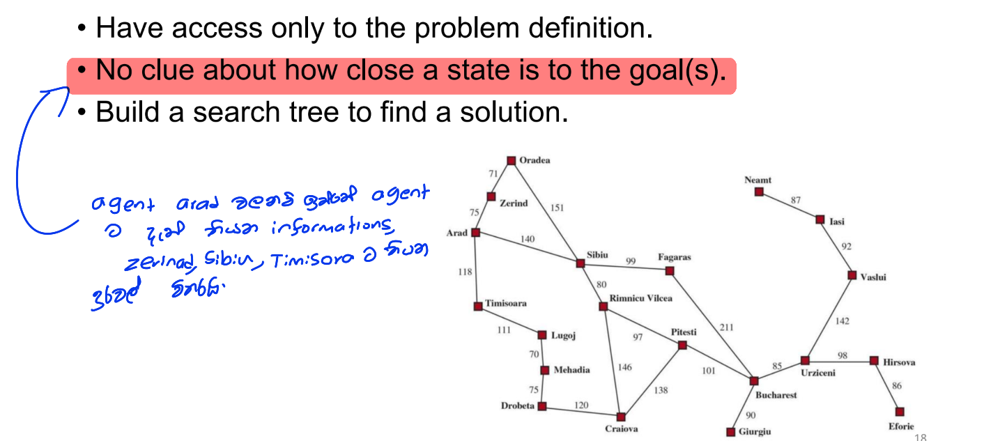

### 1. **Breadth-First Search (BFS)**


- **Approach**: BFS expands the shallowest (or least deep) unexpanded nodes first, meaning it explores all nodes at one level of the tree before moving on to the next level.

- **Completeness**: BFS is complete, meaning it will always find a solution if one exists.

- **Optimality**: BFS is optimal if all actions have the same cost, as it always finds the shallowest solution.

- **Time Complexity**: O(b^d), where **b** is the branching factor and **d** is the depth of the shallowest solution.

  > Branch wewi d durak yana nisa

- **Space Complexity**: O(b^d), which can be very large because BFS must store all nodes at the current depth level in memory.
  <mark>space is the bigger problem</mark>

### 2. **Uniform-Cost Search (UCS)** (Dijkstra)


- **Approach**: UCS expands the node with the lowest path cost (g(n)) first, making it a generalization of BFS that works with varying action costs.

- **Completeness**: UCS is complete if the path cost is non-negative and branching factor is finite.

- **Optimality**: UCS is optimal as it always finds the least-cost solution.

- **Time Complexity**: 
  $$
  O(b^{(1 + ⌊C^*/ε⌋))}
  $$
  , 
  **where **C*** is the cost of the optimal solution, and **ε is the smallest  cost.

- **Space Complexity**: 
  $$
  O(b^{(1 + ⌊C^*/ε⌋))}
  $$
  , similar to BFS, but possibly more if there are many low-cost paths.

### 3. **Depth-First Search (DFS)**


- **Approach**: DFS expands the deepest unexpanded node first, meaning it follows a single path as deep as possible before backtracking and exploring other paths.

- **Completeness**: DFS is not complete, as it might explore infinitely deep paths and never find a solution.

- **Optimality**: DFS is not optimal; It returns the first solution it finds, even if it  is not the cheapest.

- **Time Complexity**: O(b^m), where **m** is the maximum depth of the search tree.

  > Branch nowi eka line ekak dige yana uparima dura m nisa

- **Space Complexity**: O(b*m), which is linear, as DFS only needs to store a single path from the root to a leaf, along with the unexpanded siblings of each node on the path.

### 4. **Iterative Deepening Search (IDS)**

- **Approach**: IDS is a hybrid of DFS and BFS. It repeatedly applies DFS with increasing depth limits until a solution is found, effectively combining the space efficiency of DFS with the completeness and optimality of BFS.
- **Completeness**: IDS is complete, even in infinite state spaces, because it eventually explores all possible depths.
- **Optimality**: IDS is optimal for unit action costs, as it will find the shallowest solution.
- **Time Complexity**: O(b^d), comparable to BFS, though IDS revisits nodes, the revisits have little impact in practice.
- **Space Complexity**: O(b*d), which is linear, making it much more memory efficient than BFS.

### 5. **Bidirectional Search**

- **Approach**: Bidirectional search runs two simultaneous searches: one forward from the initial state and one backward from the goal state. The algorithm stops when the two searches meet.
- **Completeness**: Bidirectional search is complete if both searches are BFS or UCS.
- **Optimality**: It is optimal if both searches are optimal, such as if they use BFS or UCS.
- **Time Complexity**: O(b^(d/2)), as each search only needs to go halfway to the goal, making it much faster in practice than BFS for large search spaces.
- **Space Complexity**: O(b^(d/2)), which is significantly less than BFS, making it more space-efficient for large problems.

### 6. **Depth-Limited Search (DLS)**

- **Approach**: DLS is a variant of Depth-First Search (DFS) where the search is limited to a predefined depth limit, meaning it explores only nodes up to a certain depth in the search tree.
- **Completeness**: DLS is complete if the depth limit is greater than or equal to the depth of the solution. If the solution lies beyond the depth limit, it may not be found.
- **Optimality**: DLS is not optimal since it may find a solution, but not necessarily the least costly one.
- **Time Complexity**: O(b^l), where **l** is the depth limit. This is the same as DFS, but limited by the depth constraint.
- **Space Complexity**: O(b*l), which is linear and depends on the depth limit, similar to DFS.

### Summary of Uninformed Search Algorithms

- **BFS**: Completeness and optimality with high space complexity.
- **UCS**: Optimal for varying costs, higher space complexity. Complete.
- **DFS**: Space-efficient but risks incompleteness and suboptimality.
- **IDS**: Complete and optimal with linear space complexity, combines DFS and BFS.
- **Bidirectional Search**: Efficient in time and space, but requires a reversible goal state.
- **DLS**: A controlled variant of DFS, useful for large spaces with known depth constraints.

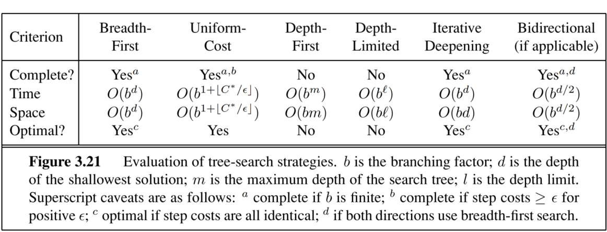

------

## 2.Informed search Algorithms (**heuristic search**)

Informed search algorithms utilize domain-specific knowledge, often in the form of heuristic functions, to guide the search process more efficiently towards a solution. These algorithms are typically more efficient than uninformed strategies because they use estimates of the cost to reach the goal to prioritize the exploration of certain paths over others.

• The hints come in the form of a heuristic function, ℎ(𝑛) . 

• ℎ(𝑛) = estimated cost of the cheapest path from the state at  node n to a goal state.<mark> • In route-finding problems - the straight-line distance on the map  between the current state and a goal.</mark>

> Imagine **f(n)** as a number that tells you how "good" or "promising" a path is at getting you to the treasure. This number helps you decide which path to follow next.
>
> Here's how it works:
>
> 1. **g(n)**: This is the cost to reach node n from the starting point. It's like counting the number of steps you've taken so far.
> 2. **h(n)**: This is the heuristic, or an estimate of the cost from node n to the goal (the treasure). It's like guessing how many steps are left to reach the treasure.
>
> The function **f(n)** combines these two values:
>
> f(n)=g(n)+h(n)
>
> - **g(n)** tells you how far you've already traveled.
> - **h(n)** gives you a guess of how much farther you still need to go.
> - **f(n)** helps you choose the best path by adding these together.
>
> So, **f(n)** is like your guide, helping you pick the path that seems quickest or shortest to get to the treasure!

#### <u>1. **Greedy Best-First Search**</u>

- **Approach**: f(n) = h(n) Expands the node that appears to be closest to the goal, as estimated by the heuristic function h(n).
- **Completeness**: No. Can lead to dead ends and the tree search version  (not the graph search version) can go into infinite loops.
- **Optimality**: It is not optimal because it only considers the estimated cost to the goal, ignoring the cost already incurred.
- **Time Complexity**: O(b^m), where **b** is the branching factor and **m** is the maximum depth.
- **Space Complexity**: O(b^m), as it needs to store all generated nodes.
- <mark> But a good heuristic can dramatically improve the time and space needed</mark>
- **Efficiency**: Greedy Best-First Search can be very efficient in practice but may also be misled by inaccurate heuristics.

##### How Greedy Best-First Search Works?

- Greedy Best-First Search works by evaluating the cost of each possible path and then expanding the path with the lowest cost. This process is repeated until the goal is reached. 
- The algorithm uses a heuristic function to determine which path is the most promising. 
- The heuristic function takes into account the cost of the current path and the estimated cost of the remaining paths. 
- If the cost of the current path is lower than the estimated cost of the remaining paths, then the current path is chosen. This process is repeated until the goal is reached.

> 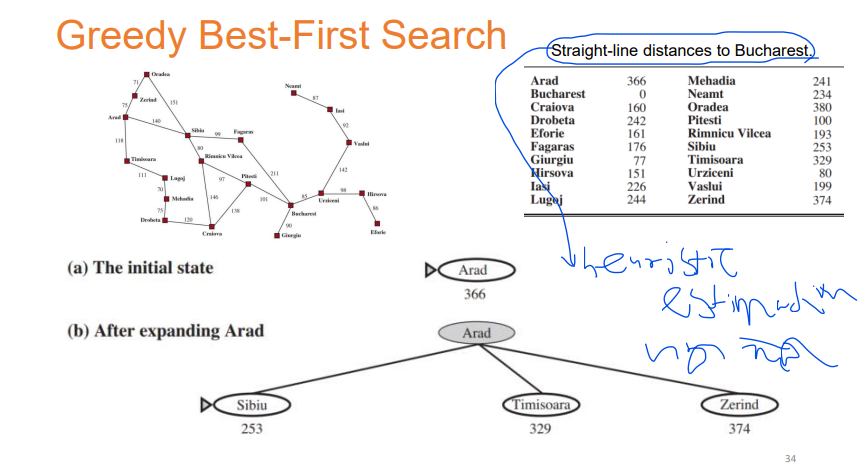
>
> 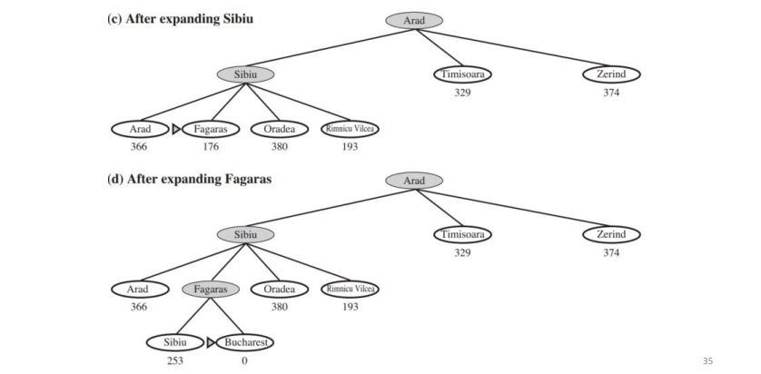
>
> 

#### 2. **A\* Search**

Idea: avoid expanding paths that are already expensive

- **Approach**: Expands the node with the lowest estimated total cost f(n)=g(n)+h(n), where g(n) is the cost to reach node n and h(n) is the estimated cost to reach the goal from n.

- f(n) -  Estimated cost of the cheapest solution through 𝑛.

- <mark> A* is identical to Uniform-cost search except A* uses 𝑔(𝑛) + ℎ(𝑛) instead of 𝑔(𝑛) . </mark>

- ### A* Search - Evaluation

  **Completeness:**

  - **Yes**: A* is guaranteed to find a solution if one exists, as long as the search space is finite and the branching factor is bounded.

  **Optimality:**

  - **Depends on Heuristic Properties**: The optimality of A* depends on the properties of the heuristic function used to estimate the cost to reach the goal.

    **1. Admissibility:** (පිළිගත හැකි)

    - **Definition**: An admissible heuristic is one that never overestimates the true cost of reaching the goal from any node n. In other words, it is always optimistic.`value we get for heuristic is less than the actual cost ex:straight line distance is less than the real value. IF we implement in this way we will get an optimal solution`
    - **Implication**: If the heuristic is admissible, A* will always find the least-cost path to the goal, making it optimal.

    **2. Consistency (or Monotonicity):** `This is stronger than addmissibility`

    - **Definition**: A heuristic h(n) is consistent if, for every node n and every successor ' n′ of n generated by an action a, the following inequality holds: h(n)≤c(n,a,n′)+h(n′) where c(n,a,n′) is the cost of taking action a from n to reach n′.

      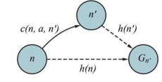

    - **Implication**: A consistent heuristic ensures that the estimated cost always aligns with the actual cost progression. If a heuristic is consistent, it is also admissible, and A* will be optimal.

  **Inadmissible Heuristic:**

  - **Implication**: If the heuristic is not admissible (i.e., it sometimes overestimates the cost), A* may find a solution, but it may not be the optimal one. The search could be misled by the heuristic into choosing suboptimal paths.

- **Time Complexity**: <mark>Exponential</mark>, depending on the accuracy of the heuristic.

- **Space Complexity**:<mark>Exponential</mark> A* has bad space complexity because it stores all generated nodes.

- **Efficiency**: A* is highly efficient with good heuristics, making it one of the most widely used search algorithms.

> 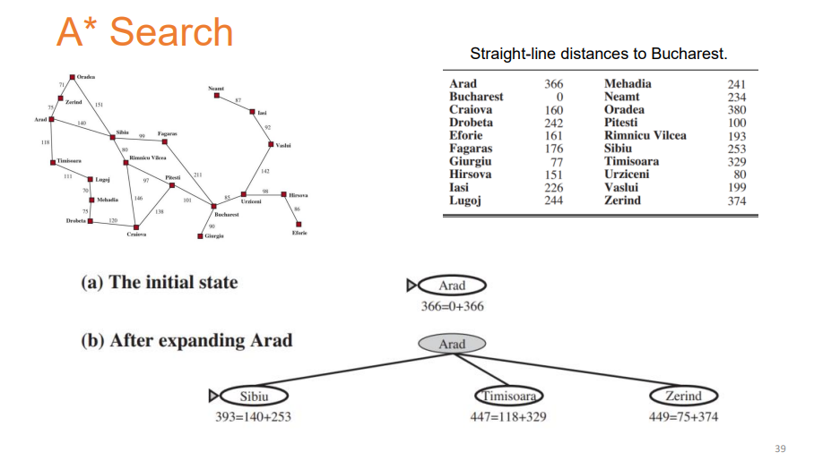
>
> 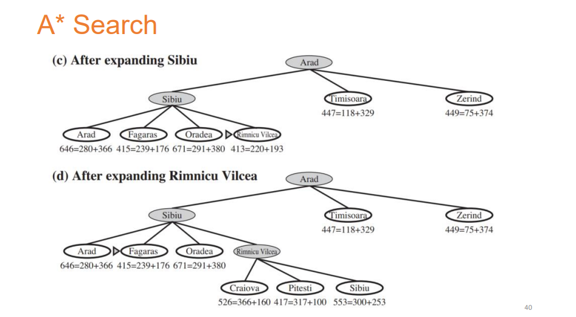
>
> 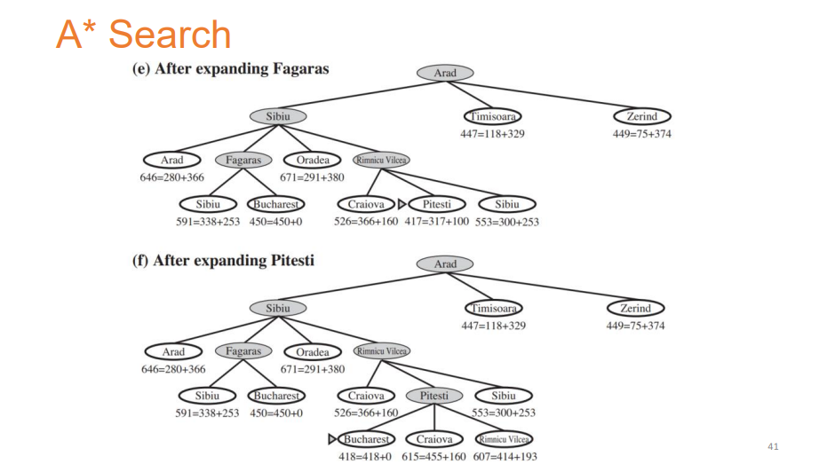

```python
import math
import heapq

# Define the Cell class
class Cell:
    def __init__(self):
        self.parent_i = 0  # Parent cell's row index
        self.parent_j = 0  # Parent cell's column index
        self.f = float('inf')  # Total cost of the cell (g + h)
        self.g = float('inf')  # Cost from start to this cell
        self.h = 0  # Heuristic cost from this cell to destination

# Define the size of the grid
ROW = 9
COL = 10

# Check if a cell is valid (within the grid)
def is_valid(row, col):
    return (row >= 0) and (row < ROW) and (col >= 0) and (col < COL)

# Check if a cell is unblocked
def is_unblocked(grid, row, col):
    return grid[row][col] == 1

# Check if a cell is the destination
def is_destination(row, col, dest):
    return row == dest[0] and col == dest[1]

# Calculate the heuristic value of a cell (Euclidean distance to destination)
def calculate_h_value(row, col, dest):
    return ((row - dest[0]) ** 2 + (col - dest[1]) ** 2) ** 0.5

# Trace the path from source to destination
def trace_path(cell_details, dest):
    print("The Path is ")
    path = []
    row = dest[0]
    col = dest[1]

    # Trace the path from destination to source using parent cells
    while not (cell_details[row][col].parent_i == row and cell_details[row][col].parent_j == col):
        path.append((row, col))
        temp_row = cell_details[row][col].parent_i
        temp_col = cell_details[row][col].parent_j
        row = temp_row
        col = temp_col

    # Add the source cell to the path
    path.append((row, col))
    # Reverse the path to get the path from source to destination
    path.reverse()

    # Print the path
    for i in path:
        print("->", i, end=" ")
    print()

# Implement the A* search algorithm
def a_star_search(grid, src, dest):
    # Check if the source and destination are valid
    if not is_valid(src[0], src[1]) or not is_valid(dest[0], dest[1]):
        print("Source or destination is invalid")
        return

    # Check if the source and destination are unblocked
    if not is_unblocked(grid, src[0], src[1]) or not is_unblocked(grid, dest[0], dest[1]):
        print("Source or the destination is blocked")
        return

    # Check if we are already at the destination
    if is_destination(src[0], src[1], dest):
        print("We are already at the destination")
        return

    # Initialize the closed list (visited cells)
    closed_list = [[False for _ in range(COL)] for _ in range(ROW)]
    # Initialize the details of each cell
    cell_details = [[Cell() for _ in range(COL)] for _ in range(ROW)]

    # Initialize the start cell details
    i = src[0]
    j = src[1]
    cell_details[i][j].f = 0
    cell_details[i][j].g = 0
    cell_details[i][j].h = 0
    cell_details[i][j].parent_i = i
    cell_details[i][j].parent_j = j

    # Initialize the open list (cells to be visited) with the start cell
    open_list = []
    heapq.heappush(open_list, (0.0, i, j))

    # Initialize the flag for whether destination is found
    found_dest = False

    # Main loop of A* search algorithm
    while len(open_list) > 0:
        # Pop the cell with the smallest f value from the open list
        p = heapq.heappop(open_list)

        # Mark the cell as visited
        i = p[1]
        j = p[2]
        closed_list[i][j] = True

        # For each direction, check the successors
        directions = [(0, 1), (0, -1), (1, 0), (-1, 0), (1, 1), (1, -1), (-1, 1), (-1, -1)]
        for dir in directions:
            new_i = i + dir[0]
            new_j = j + dir[1]

            # If the successor is valid, unblocked, and not visited
            if is_valid(new_i, new_j) and is_unblocked(grid, new_i, new_j) and not closed_list[new_i][new_j]:
                # If the successor is the destination
                if is_destination(new_i, new_j, dest):
                    # Set the parent of the destination cell
                    cell_details[new_i][new_j].parent_i = i
                    cell_details[new_i][new_j].parent_j = j
                    print("The destination cell is found")
                    # Trace and print the path from source to destination
                    trace_path(cell_details, dest)
                    found_dest = True
                    return
                else:
                    # Calculate the new f, g, and h values
                    g_new = cell_details[i][j].g + 1.0
                    h_new = calculate_h_value(new_i, new_j, dest)
                    f_new = g_new + h_new

                    # If the cell is not in the open list or the new f value is smaller
                    if cell_details[new_i][new_j].f == float('inf') or cell_details[new_i][new_j].f > f_new:
                        # Add the cell to the open list
                        heapq.heappush(open_list, (f_new, new_i, new_j))
                        # Update the cell details
                        cell_details[new_i][new_j].f = f_new
                        cell_details[new_i][new_j].g = g_new
                        cell_details[new_i][new_j].h = h_new
                        cell_details[new_i][new_j].parent_i = i
                        cell_details[new_i][new_j].parent_j = j

    # If the destination is not found after visiting all cells
    if not found_dest:
        print("Failed to find the destination cell")

def main():
    # Define the grid (1 for unblocked, 0 for blocked)
    grid = [
        [1, 0, 1, 1, 1, 1, 0, 1, 1, 1],
        [1, 1, 1, 0, 1, 1, 1, 0, 1, 1],
        [1, 1, 1, 0, 1, 1, 0, 1, 0, 1],
        [0, 0, 1, 0, 1, 0, 0, 0, 0, 1],
        [1, 1, 1, 0, 1, 1, 1, 0, 1, 0],
        [1, 0, 1, 1, 1, 1, 0, 1, 0, 0],
        [1, 0, 0, 0, 0, 1, 0, 0, 0, 1],
        [1, 0, 1, 1, 1, 1, 0, 1, 1, 1],
        [1, 1, 1, 0, 0, 0, 1, 0, 0, 1]
    ]

    # Define the source and destination
    src = [8, 0]
    dest = [0, 0]

    # Run the A* search algorithm
    a_star_search(grid, src, dest)

if __name__ == "__main__":
    main()
```

### Summary

Informed search algorithms leverage heuristics to guide the search process more effectively. Each algorithm has different strengths:

- **Greedy Best-First Search**: Efficient but not always reliable or optimal.
- **A\* Search**: Complete and optimal but requires a lot of memory.
- **Bidirectional A***: More efficient than standard A*.
- **Iterative Deepening A***: Combines the benefits of A* and DFS, with better space efficiency.
- **Beam Search**: Puts a limit on the size of the frontier.  • Incomplete and suboptimal • Efficient with reasonably good solutions.

------

## The Heuristic Function

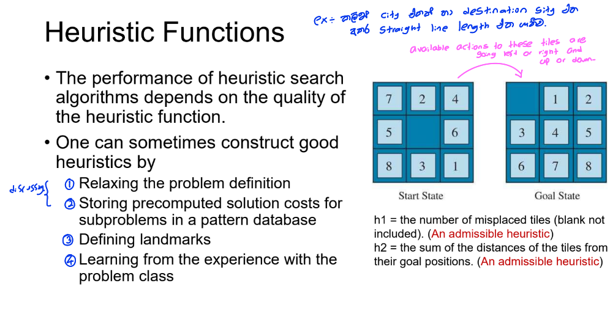

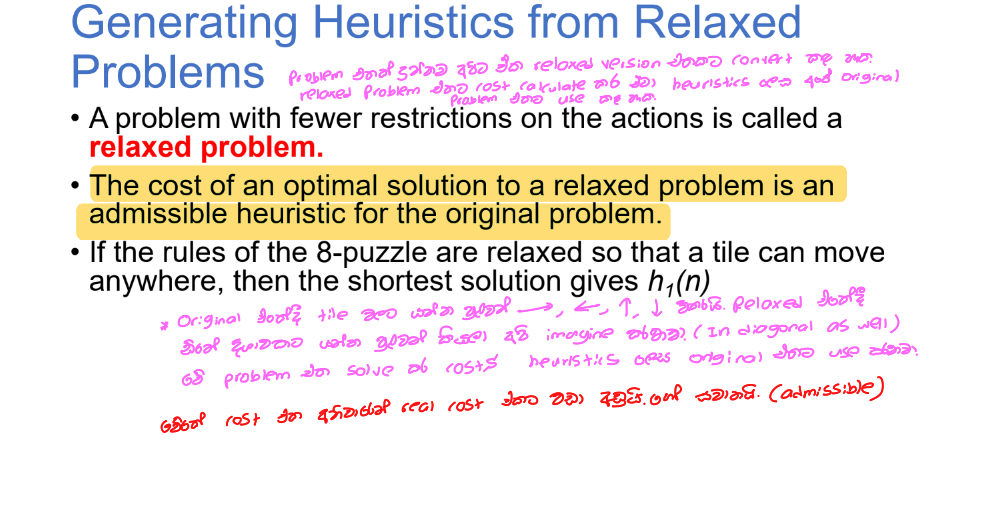

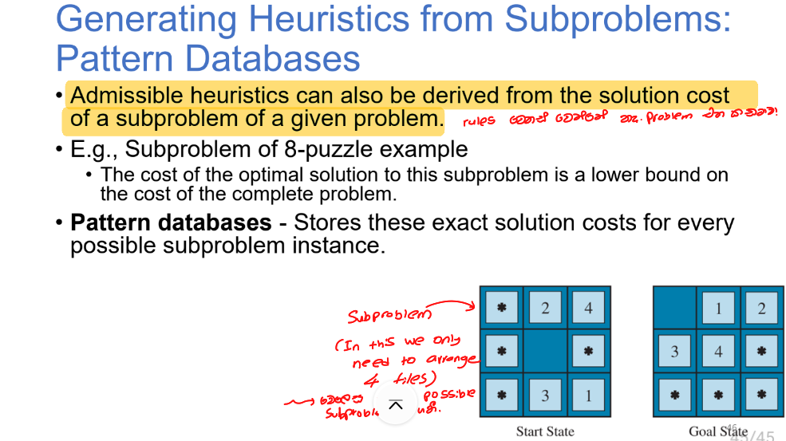
