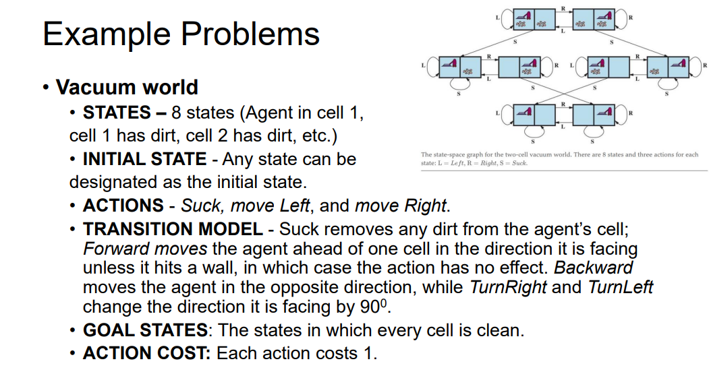

# <u>Searching</u>

### Problem-Solving Agent

> `we only talk about searching algorithms with simple environments in this module`
>
> ### Characteristics of Simple Environments
>
> - **Episodic**: Each action or decision made by the agent is independent of previous actions.
> - **Single Agent**: There is only one agent interacting with the environment.
> - **Fully Observable**: The agent has complete information about the environment at any given time.
> - **Deterministic**: The outcome of each action is certain, with no randomness involved.
> - **Static**: The environment does not change while the agent is deliberating.
> - **Discrete**: The states and actions are distinct and countable.

### Search Algorithms

Search algorithms are divided into two main categories based on whether or not they use domain-specific knowledge to guide the search:

1. **Uninformed (Blind) Search Algorithms**:
   - **Definition**: These algorithms do not have any additional information about the goal other than the problem definition. They explore the search space without any guidance or heuristic.
   - Examples:
     - <mark>**Breadth-First Search (BFS)**</mark>: Explores all nodes at the present depth level before moving on to nodes at the next depth level.
     - <mark>**Depth-First Search (DFS)**</mark>: Explores as far down a branch as possible before backtracking.
     - <mark>**Uniform-Cost Search** (**Dijkstra**)</mark> : Expands the least-cost node, useful when path costs vary.
2. **Informed (Heuristic) Search Algorithms**:
   - **Definition**: These algorithms use problem-specific knowledge (heuristics) to find solutions more efficiently than uninformed search methods. Heuristics provide an estimate of the cost from the current state to the goal, guiding the search towards more promising paths.
   - Examples:
     - <mark>**Greedy Best-First Search**</mark>: Selects the path that appears to be closest to the goal based on a heuristic.
     - <mark>**A\* Search**</mark>: Combines the cost to reach the current node and the estimated cost to reach the goal, balancing exploration and exploitation.

------

## The problem solving process

> ### 1. GOAL FORMULATION
>
> - **Purpose**: Goal formulation is the first step where the agent defines what it wants to achieve.
> - **Details**: Goals help to organize the agent's behavior by narrowing down the set of possible actions it should consider. By having a clear goal, the agent can focus its efforts on actions that are relevant to achieving that goal.
> - **Example**: If the agent is a robot in a maze, the goal might be to reach the exit. This goal limits the robot to consider only actions that move it toward the exit.
>
> ### 2. PROBLEM FORMULATION
>
> - **Purpose**: In this step, the agent creates a detailed description of the problem it needs to solve in order to reach the goal.
> - **Details**: The problem formulation includes defining the possible states of the environment, the actions available to the agent, and how these actions change the state. It also involves specifying the initial state and the goal state(s).
> - **Example**: For the robot in a maze, problem formulation would involve mapping out the maze, identifying the start position (initial state), and the location of the exit (goal state). The robot would also define actions like "move forward," "turn left," and "turn right."
> - ex : states: various cities |  actions: drive between cities
>
> ### 3. SEARCH
>
> - **Purpose**: The search process involves finding a sequence of actions that will lead from the initial state to the goal state.
> - **Details**: Before the agent acts in the real world, it uses a model of the environment to simulate different sequences of actions. The agent searches through possible action sequences until it finds one that successfully leads to the goal. This sequence of actions is called a solution.
> - **Example**: The robot might simulate various paths through the maze, trying different combinations of moves until it finds one that leads to the exit.
>
> ### 4. EXECUTION
>
> - **Purpose**: After finding a solution, the agent executes the actions in the real world.
> - **Details**: The agent carries out the actions one by one, as determined by the search process, to move from the initial state to the goal state. If the environment is static and deterministic, the agent can follow the plan exactly as simulated.
> - **Example**: The robot, having found the correct path to the exit in the search phase, now physically moves through the maze, following the planned sequence of moves to reach the exit.
>
> ### Summary
>
> - **Goal Formulation**: Defines what the agent wants to achieve.
> - **Problem Formulation**: Outlines the problem by describing the states, actions, and environment.
> - **Search**: Finds the solution by simulating possible sequences of actions.
> - **Execution**: Implements the solution by performing the actions in the real environment.

## Components of a search problem

> 
>
> ### 1. **State Space**
>
> - **Definition**: The state space is the set of all possible states that the environment can be in. Each state represents a configuration of the environment at a specific moment.
> - **Example**: In a navigation problem, the state space might include all possible locations the agent can be in.
>
> ### 2. **Initial State**
>
> - **Definition**: The initial state is the state in which the agent starts. It’s the starting point of the search process.
> - **Example**: If the agent is a car, and it starts in Arad (a city), then Arad is the initial state.
>
> ### 3. **Goal States**
>
> - **Definition**: Goal states are the states that the agent aims to reach. The problem may have one or multiple goal states.
> - Types:
>   - **Single Goal State**: There is only one state that the agent needs to reach (e.g., Bucharest).
>   - **Multiple Goal States**: The agent can achieve its objective by reaching any one of several goal states. For instance, a vacuum cleaner’s goal might be any state where all locations are clean.
> - **Generalized Goal**: Sometimes the goal is defined by a property that applies to many states.
>
> ### 4. **Actions**
>
> - **Definition**: Actions are the operations available to the agent that can change the state of the environment. Given a state s, the set of actions ACTIONS(s) returns all possible actions that can be taken in that state.
> - **Example**: In the case of a car in Arad, the available actions might be "Drive to Sibiu," "Drive to Timisoara," or "Drive to Zerind."
>
> ### 5. **Transition Model**
>
> - **Definition**: The transition model describes the result of taking an action in a given state. RESULT(s,a) returns the new state that results from performing action a in state s.
> - **Example**: If the car is in Arad and takes the action "Drive to Zerind," the resulting state would be Zerind.
>
> ### 6. **Action Cost Function**
>
> - **Definition**: The action cost function assigns a numeric cost to performing an action in a given state to reach another state. ACTION_COST(s,a,s′) represents the cost of applying action a in state s to reach state s′.
> - **Example**: The cost could be the distance in miles or the time it takes to drive from Arad to Zerind.
>
> ### 7. **Path**
>
> - **Definition**: A path is a sequence of states connected by a sequence of actions. The path represents a possible journey from the initial state to the goal state.
>
> ### 8. **Solution**
>
> - **Definition**: A solution to the search problem is a path from the initial state to a goal state. It shows how the agent can reach its objective.
>
> ### 9. **Optimal Solution**
>
> - **Definition**: The optimal solution is the path that has the lowest cost among all possible solutions. It represents the most efficient way to reach the goal state.
>
> ### 10. **Graph Representation**
>
> - Definition: The state space can be represented as a graph where:
>   - **Vertices (Nodes)** represent the states.
>   - **Directed Edges** represent the actions that move the agent from one state to another.
> - **Example**: In a map, cities would be nodes, and roads between them would be edges.
>
> ### 11. **Model**
>
> - **Definition**: A model is an abstract mathematical description of the problem. It includes the state space, actions, transition model, and goal state(s).
> - **Example**: Formulating the problem of reaching Bucharest from any given city.
>
> ### 12. **Abstraction**
>
> - **Definition**: Abstraction involves simplifying the problem by removing unnecessary details. The goal is to create a representation that captures essential aspects of the problem while ignoring complexities that don't affect the solution.
> - **Purpose**: The right level of abstraction ensures the problem is neither too complex nor too simplified, making it easier to solve while still being relevant to the real world.
>
> 
>
> 

# <u>Search algorithms</u>

> > ### Redundant Paths
> >
> > - **Definition**: Redundant paths occur when there are multiple ways to reach the same state, but with different costs. These paths do not add any value because they lead to the same state but take more steps or cost more resources (like time or distance).
> >
> > - **Example**: Consider the task of reaching the city of Sibiu:
> >
> >   - One path might be **Arad → Sibiu** (direct path, 140 miles).
> >   - Another path might be **Arad → Zerind → Oradea → Sibiu** (indirect path, 297 miles).
> >
> >   While both paths get you to Sibiu, the second path is much longer and therefore redundant if the goal is to find the shortest route.
> >
> > ### Repeated States
> >
> > - **Definition**: A repeated state is when the search process encounters a state that has already been visited. This often happens when exploring different branches of the search tree or graph.
> > - **Example**: If you revisit the state Sibiu through different paths, like both the direct and indirect paths mentioned above, you encounter the state Sibiu multiple times.
>
> ## measuring problem
>
> - ***Completeness*** ensures that a solution is found if one exists.
> - ***Cost Optimality*** ensures the solution is the best among all possible solutions.
> - ***Time Complexity*** measures how fast the algorithm finds a solution.
> - ***Space Complexity*** measures how much memory the algorithm uses.
>
> ### Factors Affecting Time and Space Complexity
>
> - <mark>**b (Branching Factor)**: The maximum number of successors a node can have.</mark> Higher **b** increases both time and space complexity because the algorithm needs to consider more possibilities at each level.
> - <mark>**d (Depth of the Least-Cost Solution)**: The depth at which the optimal solution is found.</mark> Deeper solutions increase the number of states the algorithm must explore, affecting time complexity.
> - <mark>**m (Maximum Path Length)**: The maximum number of actions in any path.</mark> If **m** is infinite, certain search strategies may not terminate, affecting completeness and optimality.

