#            	<u>Local Search And Optimization</u>

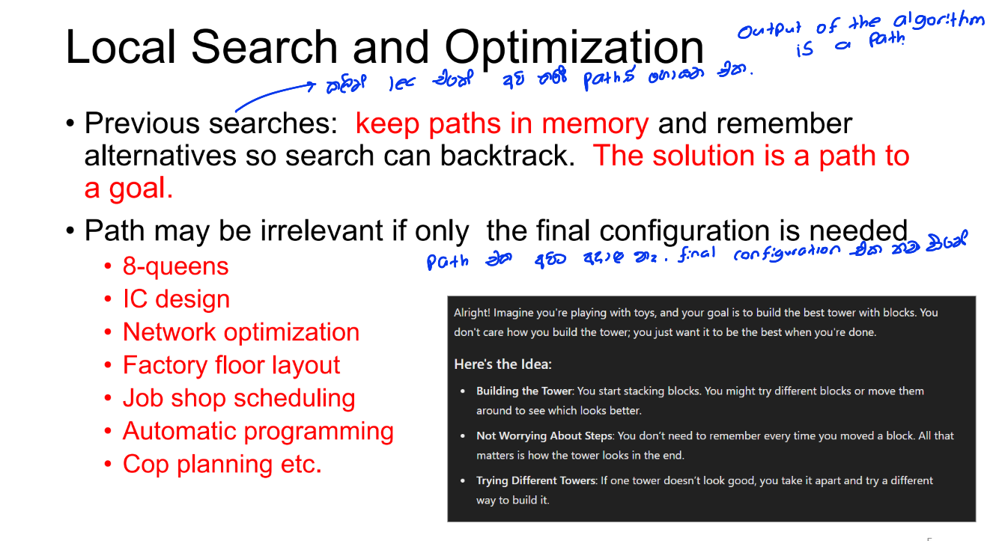

## 1. Local Search in Artificial Intelligence

> **Local Search** is an optimization algorithm used to solve problems by iteratively improving a single candidate solution. <u>It's a heuristic method that searches for a better solution by exploring the neighbors of the current solution until it finds an optimal or satisfactory result.</u>
>
> ### Key Concepts of Local Search:
>
> 1. **Neighborhood**:
>
>   - A neighborhood is the set of all possible solutions that can be reached from the current solution by making a small change.
>    - The choice of neighborhood structure is critical as it determines how the search space is explored.
>
> 2. **Hill Climbing**:
>
>   - This is a simple form of local search where the algorithm moves to the neighbor with the highest improvement over the current state.
>    - If no neighbors are better, the search stops, which can lead to local optima.
>
> 3. **Simulated Annealing**:
>
>   - An advanced form of local search that allows the algorithm to escape local optima by occasionally accepting worse solutions.
>    - The probability of accepting a worse solution decreases over time.
>
> 4. **Local Beam Search**:
>
>   - Local Beam Search keeps track of multiple states (or solutions) at once rather than just one.
>    - The algorithm starts with several randomly generated solutions and iteratively moves to their best neighbors.
>    - It focuses on the most promising areas of the search space, potentially improving the chances of finding the global optimum.
>    - The algorithm can suffer from "convergence" where all the candidate solutions become similar, leading to less diversity in search.
>
> 5. **Genetic Algorithms**:
>    - Although broader than just local search, genetic algorithms can incorporate local search techniques within their mutation and crossover steps to improve individuals.
>
> ### Application Areas:
>
> - **Traveling Salesman Problem (TSP)**: Finding the shortest possible route that visits each city exactly once and returns to the origin city.
> - **Job Scheduling**: Allocating jobs to machines in a way that minimizes the total processing time.
> - **Constraint Satisfaction Problems (CSPs)**: Assigning values to variables under constraints (e.g., Sudoku).
>
> ### Advantages:
>
> - **Efficiency**: Local search algorithms are generally faster than global optimization methods since they focus on a specific area of the solution space.
> - **Memory Usage**: They require less memory as they typically operate on a single solution or a small set of solutions at a time.
>
> ### Disadvantages:
>
> - Not systematic ➔ Might never explore a portion of the search  space where the solution exists. 
>
> - **Local Optima**: The primary challenge is the risk of getting stuck in local optima, where no neighboring solution is better, but a global optimal solution exists elsewhere.
> - **No Guarantee of Global Optimality**: Local search does not always guarantee that the solution found is the global best solution.
> - **Convergence in Local Beam Search**: There is a risk that all candidate solutions converge to a similar area in the search space, reducing exploration diversity.

## 2. Optimization

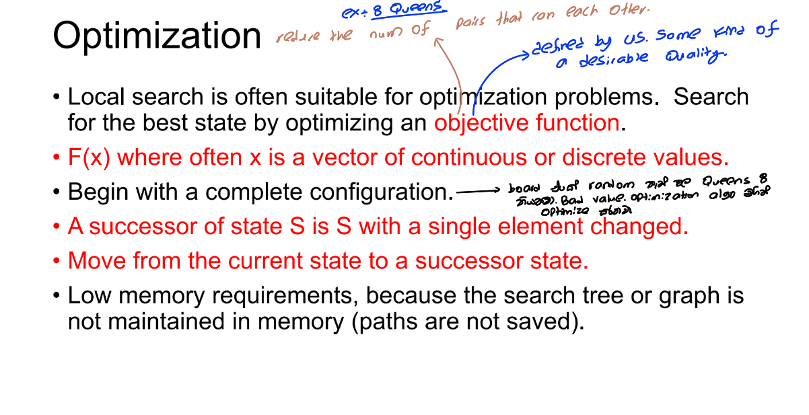

#### example

> 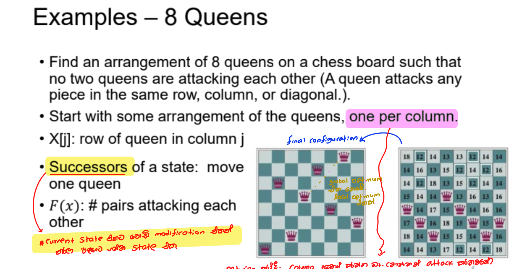
>
> 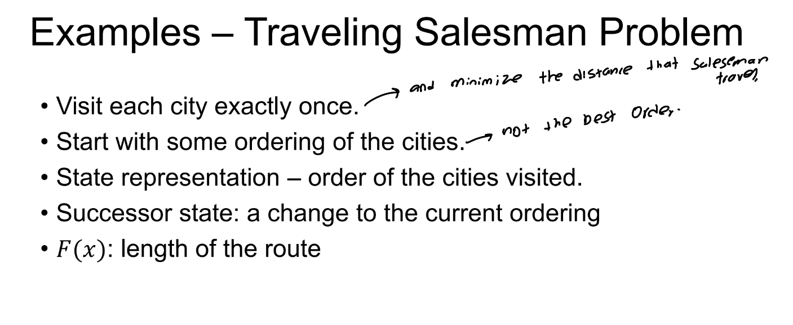

## 3.Tree search vs local Searches

1. **Starting State**:

   - **Tree Search **(Last Lecture ) : Typically begins with an *incomplete* configuration and builds towards a goal.
   - **Local Search **: Begins with a *complete* configuration and iteratively improves it.

2. **Goal Test**:

   > A **binary goal test** is a type of evaluation in search algorithms that checks whether a given state satisfies the goal condition. It’s called "binary" because the result is one of two possible outcomes:
   >
   > 1. **True (Goal Achieved)**: The current state meets all the criteria of the goal.
   > 2. **False (Goal Not Achieved)**: The current state does not meet the goal criteria.
   >
   > In a binary goal test, the algorithm typically traverses a search space and applies this test to each state it encounters. If the test returns true, the search can stop, as the goal has been found. If false, the search continues.

   - **Tree Search**: Involves a *binary goal test*—a state either satisfies the goal or it doesn't.
   - **Local Search**: May not have a binary goal test. Instead, states are evaluated based on an *objective function*, unless a goal can be defined (e.g., no attacking pairs in the 8-queens problem).

3. **Heuristic vs. Objective Function**:

   

   - **Tree Search**: Uses a *heuristic function* to estimate the distance to the nearest goal.
   - **Local Search**: Uses an *objective function* to measure the quality of a state—how good is the current configuration?

4. **Memory Usage**:

   - **Tree Search**: Requires saving paths from the start state to potential goal states, leading to higher memory usage.
   - **Local Search**: Starts with a complete configuration and makes local modifications to improve it, with low memory requirements since paths are not saved.

---

## 4.Visualizing a Local Search

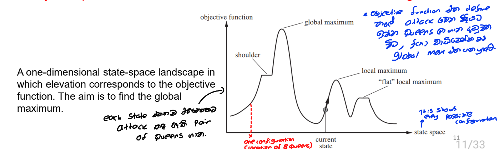

### Key Points:

1. **States as a Landscape**:
   - The different states of the problem are visualized as a landscape, where each point on the landscape represents a possible state.
2. **Elevation as Objective Function Value**:
   - The height or elevation of each point on the landscape corresponds to the value of the objective function for that state. Higher elevations represent better (higher) values of the objective function if maximizing, and lower elevations represent better values if minimizing.
3. **Moving on the Landscape**:
   - The goal of the search is to move around this landscape to find the highest peak (if maximizing) or the lowest valley (if minimizing). This corresponds to finding the optimal state.
4. **Limited Memory Usage**:
   - The search only keeps track of the current state and its immediate neighbors, which minimizes memory usage. The search does not need to store the entire landscape.

### Diagram Explanation:

- **Objective Function**: The vertical axis represents the objective function, which the algorithm tries to optimize.
- **State Space**: The horizontal axis represents different possible states.
- **Local Maximum**: A peak that is higher than the immediate surroundings but not necessarily the highest point on the landscape.
- **Global Maximum**: The highest point on the entire landscape, representing the optimal solution.
- **Current State**: The state the search is currently evaluating.
- **Shoulder**: A flat or gently sloping region that may present challenges in identifying the direction to move.
- **"Flat" Local Maximum**: A region where the objective function values are similar, making it difficult to determine the best move.

------

## 5.Local Search Algorithms

- Strategies for choosing the state to visit next  
  - Hill climbing  
  - Simulated annealing 
- Then, an extension to multiple current states: 
  - Local Beam search
  - Genetic algorithms

> # 1.Algorithms for choosing one state to visit next

### 1.*<u>Hill Climbing</u>* ( A Greedy Local Search algorithm)

<mark>• Here, we assume maximization rather than minimization.</mark>

#### Steps of Hill Climbing:

> 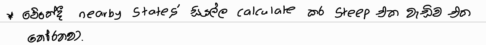

1. **Generate Nearby Successor States**:
   - From the current state, generate a set of neighboring states. These are potential solutions that are similar to the current state but differ in some way.
   - The way these neighbors are generated depends on the problem. For example, in a numerical optimization problem, neighbors might be generated by making small adjustments to the variables.
2. **Evaluate and Choose the Best Neighbor**:
   - Evaluate each of the neighboring states based on a defined objective function (or fitness function).
   - Select the neighbor with the best value according to the objective function. This is a greedy step because it always chooses the best available option at the moment.
3. **Replace the Current State**:
   - Replace the current state with the selected neighbor, effectively moving to that state in the solution space.
4. **Repeat**:
   - The process is repeated until a termination condition is met, such as when no better neighboring state exists (local maximum), a certain number of iterations are completed, or a satisfactory solution is found.

Pseudocode

> 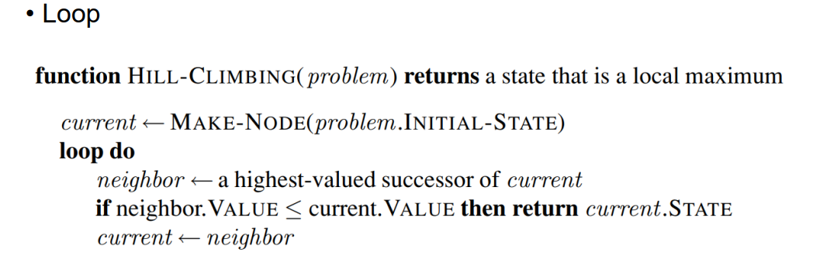

#### Considerations:

- **Local Maximum**: Hill Climbing can get stuck in local maxima, which are points where the algorithm can no longer find better neighboring states but isn't at the global maximum.

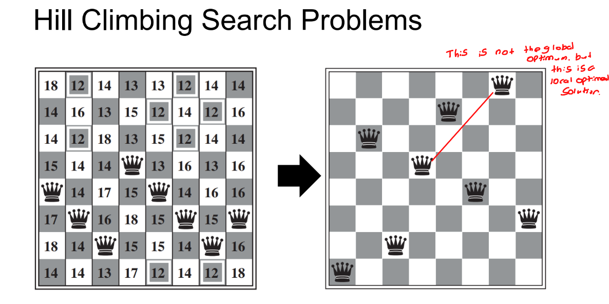

- **Plateaus and Ridges**: It can also struggle with plateaus (areas of the search space where the function value is the same for neighboring states) and ridges (narrow areas of high value).

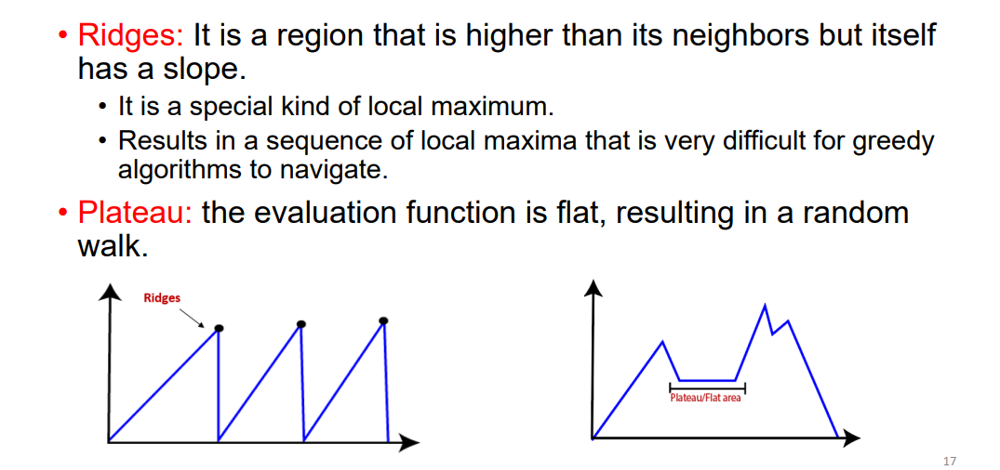

#### Variants of Hill Climbing

1. **Stochastic Hill Climbing**:

   > 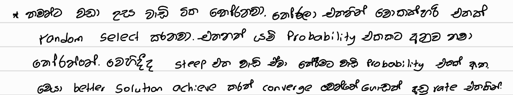**How it Works**: Instead of always choosing the steepest (most optimal) uphill move, stochastic hill climbing randomly selects an uphill move from the available options. The probability of selecting a move can be influenced by the steepness of the move, meaning steeper moves may be chosen more often, but there's still a chance of selecting less steep moves.

   - **Advantages**: This method can help avoid local maxima and plateaus by not always following the strictest path upwards.<mark> It usually converges more slowly than steepest ascent hill climbing but can find better solutions in complex landscapes.</mark>
   - **Use Case**: Stochastic hill climbing is beneficial when the search space has many local maxima or when you want to explore the search space more thoroughly.

2. **First-Choice Hill Climbing**:

   > 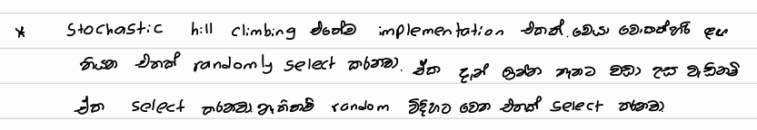

   - **How it Works**: This variant implements stochastic hill climbing by generating successors randomly until one is found that is better than the current state. As soon as a better state is found, the algorithm moves to it.

   - **First-Choice Hill Climbing** is <mark>a variant of the Hill Climbing algorithm that is designed to handle situations where there are many possible successor states from the current state. Instead of evaluating all possible successors to find the best one, First-Choice Hill Climbing simplifies the process by randomly generating successors one at a time and moving to the first one that is better than the current state.</mark>

     #### **How It Works:**

     - **Random Successor Generation**: The algorithm begins by generating a random successor to the current state. This successor is not guaranteed to be the best possible option but is simply one of many potential neighbors.
     - **Immediate Evaluation**: As soon as a successor is generated, it is immediately evaluated to see if it is better than the current state (according to the objective function or fitness function).
     - **Move to Better State**: If the randomly generated successor is better, the algorithm moves to this new state, making it the new current state.
     - **Repeat**: The process repeats from this new state, again generating successors randomly and moving to the first one that is better.

     This approach continues until a termination condition is met, such as reaching a state where no better successors can be found, a maximum number of iterations is reached, or another predefined condition.0

3. **Random-Restart Hill Climbing**:

   - **How it Works**: This variant involves performing multiple hill-climbing searches, each starting from a different random initial state. The search continues until a goal state is found, with the best solution across all restarts being saved.
   
     - **Initialization:** Randomly select a starting point for the hill-climbing search.
   
       **Local Search:** Perform the hill-climbing algorithm to find a local optimum.
   
       **Restart:** After reaching a local optimum, restart the search from a new random starting point.
   
       **Repeat:** Continue restarting and searching until a stopping condition is met (e.g., time limit or number of iterations).
   
       **Best Solution:** Keep track of the best solution found across all restarts.
   - **Advantages**: Random-restart hill climbing is surprisingly effective because it can escape local maxima by simply starting over from a new point in the search space. If the search space is such that all states have an equal probability of being generated, the algorithm is complete with a probability approaching 1, meaning it will eventually find a goal state if given enough restarts.
   - **Use Case**: This variant is useful when the search space is rugged with many local maxima or plateaus. It increases the chances of finding the global maximum, especially in complex landscapes.

------

### 2.<u>*Simulated Annealing*</u>

Simulated Annealing is an optimization algorithm inspired by the annealing process in metallurgy, where materials are heated and then gradually cooled to remove defects and improve their structure. This algorithm combines aspects of hill climbing with controlled randomization, allowing it to escape local optima and explore the search space effectively.

Key Concepts of Simulated Annealing

1. **Local Maximum Problem**:
   - Traditional hill-climbing algorithms only make "uphill" moves, meaning they can easily get stuck in local maxima, which are points better than their neighbors but not the best overall solution.

2. **Random Walk**:
   - A purely random approach would eventually find the global maximum but would be inefficient and time-consuming due to the lack of direction in the search process.

3. **Combining Strategies**:
   - Simulated Annealing introduces randomness to hill climbing, allowing the algorithm to make occasional "downhill" moves (worse moves) to escape local maxima and explore more of the search space.

##### **How Simulated Annealing Works**

1. **Metallurgical Metaphor**:

   - The algorithm is based on the annealing process used in metallurgy, where metals and glass are heated to a high temperature and then cooled gradually to form a stronger structure.

2. **Temperature**:

   - The algorithm starts with a high temperature (T), which allows for a greater probability of making worse moves. As the search progresses, the temperature is gradually decreased according to a predefined cooling schedule.

3. **Iteration Steps**:

   - **Generate Successor**: From the current state, generate a random neighbor (successor).

   - **Evaluate**:

     - If the successor is better than the current state, move to it.

     - If the successor is worse, accept it with a probability that depends on both the change in evaluation (ΔE) and the current temperature (T). The probability of accepting a worse move is given by:
       $$
       P(\text{move}) = e^{(\frac{\Delta E}{T})}
       $$
       where ΔE is the difference in evaluation between the new and current states.

   - **Acceptance Probability**:

     - Higher temperatures (T) allow for more frequent acceptance of worse moves, while lower temperatures restrict this, leading to more focused searching.

4. **Cooling Schedule**:

   - The temperature is reduced over time based on a cooling schedule, which determines how quickly T decreases as the algorithm runs. This schedule is crucial for balancing exploration and exploitation:
     - At high temperatures, the algorithm makes many moves and explores the search space widely.
     - As T decreases, the algorithm becomes more conservative, focusing on refining the current solution with fewer bad moves.

Parameters:

- **ΔE (Energy Difference)**: The difference in evaluation between the current state and the new state. A larger ΔE makes it less likely that the worse state will be accepted.
- **T (Temperature)**: A parameter controlling the probability of accepting worse moves. A high temperature allows for greater exploration, while a temperature close to zero results in very few or no bad moves.

##### Pseudocode

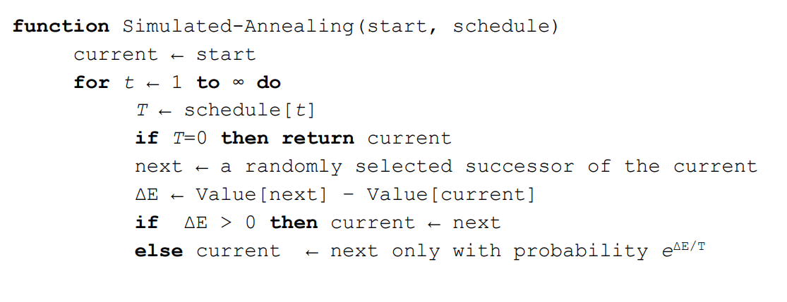

------

> # 2. Extension to multiple current states

### 3.<u>*Local Beam Search*</u>

Local Beam Search is an optimization technique that enhances the basic hill climbing algorithm by keeping track of multiple states instead of just one. This approach allows for greater exploration of the search space and increases the likelihood of finding a solution.

##### Key Concepts of Local Beam Search

1. **Multiple States**:
   - Unlike traditional hill climbing, which only maintains a single current state, Local Beam Search keeps track of k states. This allows the algorithm to explore multiple paths simultaneously and reduces the chances of getting stuck in a local maximum.
2. **Initialization**:
   - The algorithm begins with k randomly generated states. These states represent the starting points for the search process.
3. **Generating Successors**:
   - At each iteration, the algorithm generates all possible successors of the k current states. This creates a comprehensive list of potential next steps in the search process.
4. **Goal Check**:
   - After generating the successors, the algorithm checks if any of these states are goal states. If a goal state is found, the algorithm halts, and the search is complete.
5. **Selection of Best Successors**:
   - If no goal states are found, the algorithm selects the best k successors from the complete list of generated successors. This selection is based on the evaluation of the successor states, prioritizing those with the highest value.
6. **Iteration**:
   - The process repeats: the successors of the new k states are generated, evaluated, and the best k successors are retained for the next iteration. 

##### Challenges and Considerations

- **Concentration of Successors**:
  - One potential issue with Local Beam Search is that the selected successors can become concentrated in a small part of the state space. This can lead to a lack of diversity and an increased risk of getting stuck in local maxima.
- **Stochastic Beam Search**:
  - To mitigate the concentration problem, a variant known as **Stochastic Beam Search** can be employed. In this approach, successors are selected based on their probability proportional to their value. This means that higher-valued successors are more likely to be chosen, but there is still a chance for lower-valued successors to be included.
  - By incorporating randomness into the selection process, Stochastic Beam Search increases the diversity of states being explored, helping the algorithm avoid getting trapped in narrow regions of the search space.

------

### 4.<u>*Genetic Algorithms*</u>

Genetic Algorithms are a type of search and optimization technique inspired by the principles of natural selection and genetics. They are particularly effective for complex problems with large search spaces, where traditional methods like hill climbing may struggle to find optimal solutions.

#### Key Concepts of Genetic Algorithms

####  .png)

1. **Relationship to Local Beam Search**:

   - Genetic Algorithms can be thought of as an extension of local beam search. However, instead of generating successors through simple mutation or selection, GAs create new states by combining the characteristics of two parent states.

2. **Population Initialization**:

   - The algorithm starts with a population of k randomly generated states. Each state, also called an individual, is typically represented as a string of symbols (often binary digits 0s and 1s) over a finite alphabet.

   

   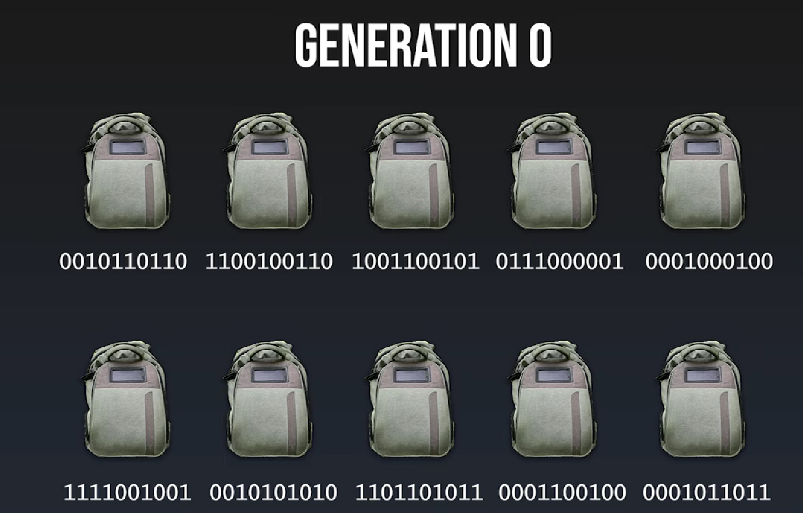

   

3. **Fitness Function**:

   - Each individual in the population is evaluated using a fitness function, which determines how well the individual solves the problem at hand. The fitness function assigns a score to each individual, with higher scores indicating better solutions.

   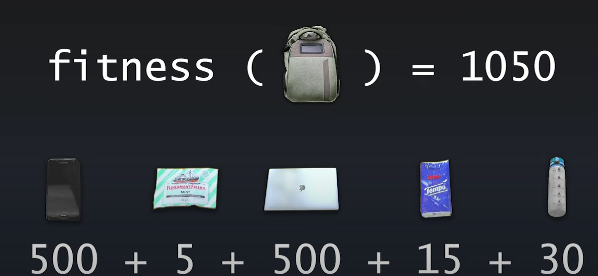 If the weight limit is exceeded the fitness of the specimen is 0.

   

   

   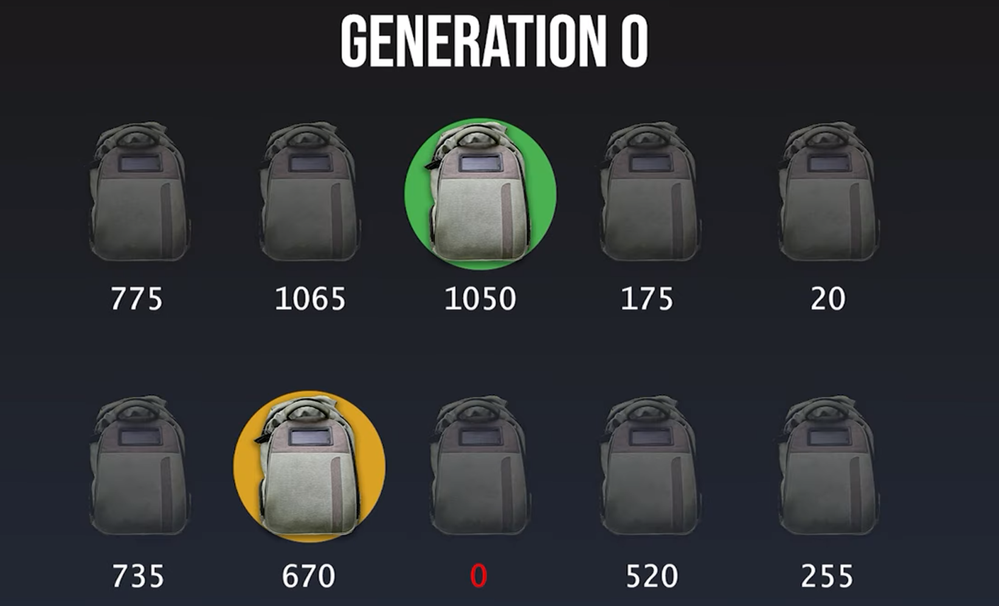  Specimens with higher fitness values are most likely to select for reproduce. 

   

4. **Genetic Operators**:

   - Selection :

     - Individuals are selected from the current population based on their fitness scores. Higher fitness individuals are more likely to be selected for reproduction. Selection is often done with replacement, allowing highly fit individuals to be selected multiple times.

   - Crossover (Recombination) :

     - Selected individuals (parents) are paired randomly, and their genetic material is combined to produce offspring. This is done by selecting random crossover points in the parent strings and swapping segments of the strings to create new individuals.
       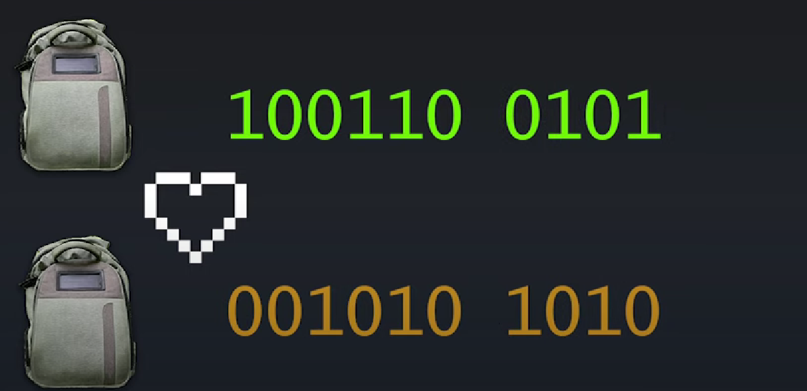 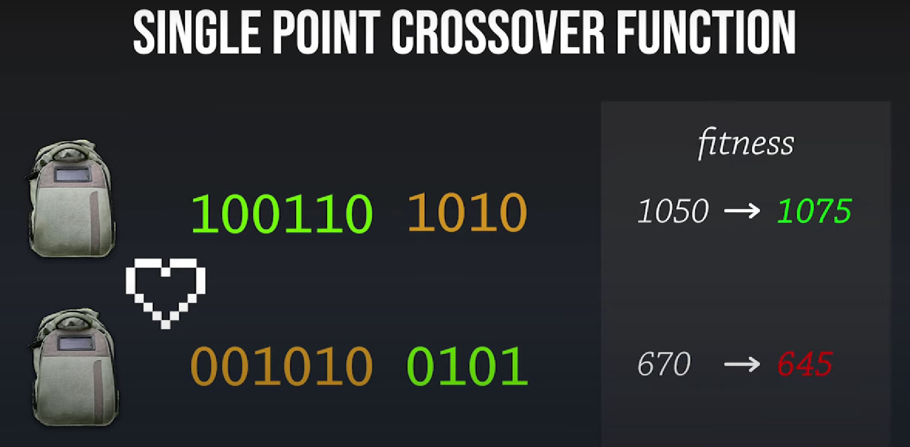

     - We repeat this crossing process until we get enough specimens for the next generation .

     - The next generation of the population is formed primarily from the newly generated offspring. However, to maintain some continuity, a few of the top-scoring individuals from the current generation (<mark>elitism</mark>) may also be included in the next generation.

       .png)

     - Culling:

       - Individuals with fitness scores below a certain threshold may be discarded, preventing them from reproducing and ensuring that the population remains healthy and competitive.

   - Mutation:

     - After crossover, offspring may undergo random mutations, where some elements in their strings are altered. The mutation rate determines how frequently these random changes occur. Mutation introduces genetic diversity, helping the algorithm explore a broader range of solutions.

     .png)

     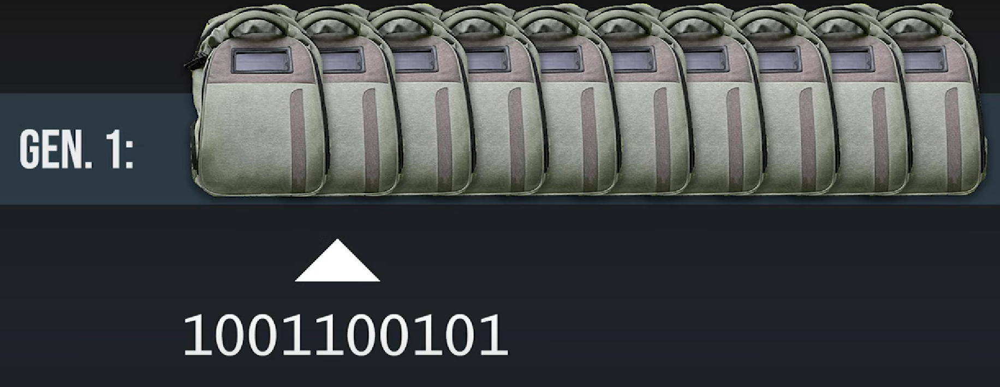  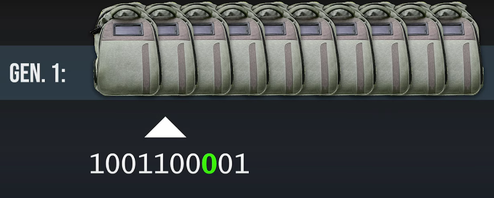

#### Pseudocode

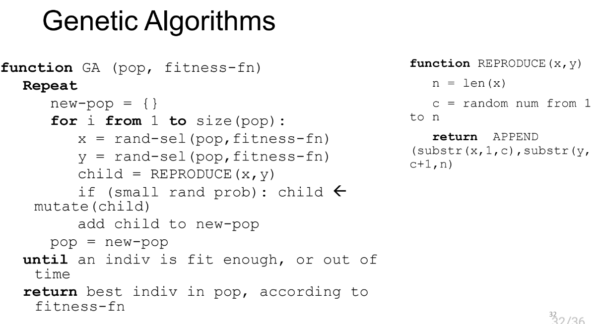

#### Comments on Genetic Algorithms

- **Positive Aspects**:
  - **Exploration**: Genetic Algorithms can explore areas of the search space that might be unreachable by traditional local search methods. This is primarily due to the crossover operator, which allows for the combination of good solutions to create potentially better offspring.
  - **Evolutionary Appeal**: GAs are inspired by biological evolution, making them intuitively appealing as a natural way to solve problems.
- **Challenges**:
  - **Tunable Parameters**: GAs require the careful tuning of multiple parameters, including population size, crossover rate, mutation rate, and selection pressure. These parameters significantly impact performance and must be adjusted based on the specific problem.
  - **Performance Consistency**: GAs can be inconsistent, with performance varying significantly across different problems. This inconsistency makes it difficult to predict their effectiveness in new situations.
  - **Empirical Evidence**: Despite their popularity, there is a lack of strong empirical evidence showing that GAs consistently outperform simpler methods like hill climbing with random restarts. Their effectiveness often depends on the specific problem and how well the parameters are tuned.

#### examples

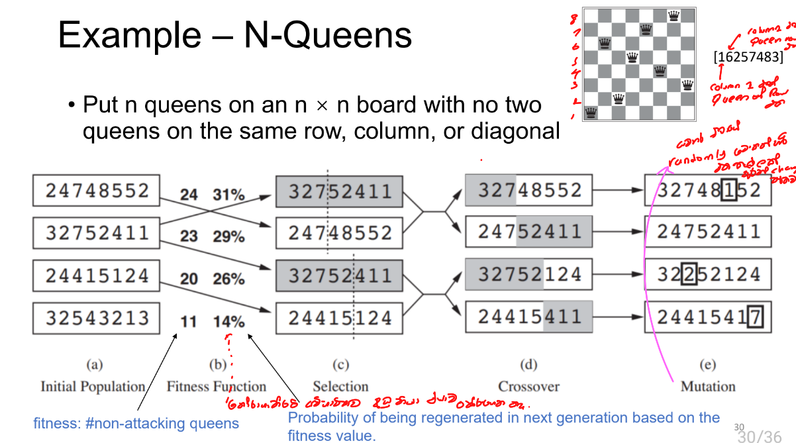

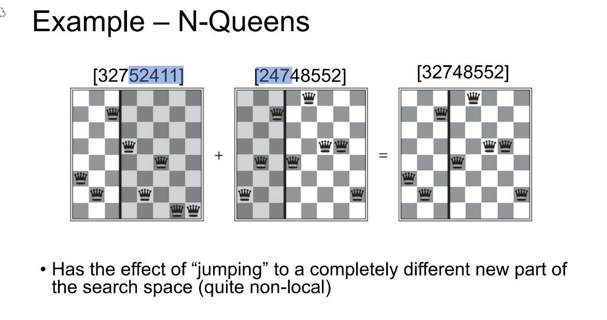