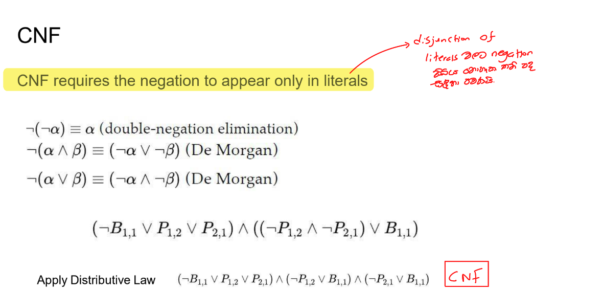

# <u>Agents</u>


## Logical Agents


### Knowledge


```js
function KB-Agent(percept) returns an action
    persistent:
        KB, a knowledge base
        t, a counter, initially 0, indicating time

    // Update the knowledge base with the current percept and time
    Tell(KB, Make-Percept-Sentence(percept, t))

    // Query the knowledge base to decide the next action
    action ← Ask(KB, Make-Action-Query(t))

    // Update the knowledge base with the chosen action and time
    Tell(KB, Make-Action-Sentence(action, t))

    // Increment time counter
    t ← t + 1

    // Return the chosen action
    return action
```

1. **KB**: The knowledge base, which holds the agent's knowledge.
2. **t**: A counter that tracks time, initially set to 0.
3. **Tell**: A function that updates the knowledge base with new information.
4. **Ask**: A function that queries the knowledge base to decide on an action.
5. **Make-Percept-Sentence**: Constructs a percept-based sentence to update the knowledge base.
6. **Make-Action-Query**: Constructs a query to determine what action the agent should take.
7. **Make-Action-Sentence**: Constructs a sentence to record the chosen action in the knowledge base.

------

# Logics

 Propositional Logic vs First-Order Logic

| **Feature/Aspect**         | **Propositional Logic**                                 | **First-Order Logic (FOL)**                                  |
| -------------------------- | ------------------------------------------------------- | ------------------------------------------------------------ |
| **Basic Elements**         | Propositions (atomic sentences)                         | Objects, predicates, and quantifiers            |
| **Symbols**                | Logical connectives (¬, ∧, ∨, →, ↔)                     | Logical connectives (¬, ∧, ∨, →, ↔), quantifiers (∀, ∃)      |
| **Variables**              | No variables                                            | Variables to represent objects                               |
| **Predicates**             | Not used                                                | Used to represent properties or relations                    |
| **Quantifiers**            | No quantifiers                                          | Existential (∃) and Universal (∀) quantifiers                |
| **Interpretation**         | Propositions are either true or false                   | Depends on the interpretation of objects and predicates      |
| **Expressiveness**         | Can express simple logical statements                   | More expressive, can represent relationships between objects |
| **Example of a Statement** | `p ∧ q` (Proposition "p" and proposition "q")           | ∀x (P(x) → Q(x)) (For all x, if P(x) is true, then Q(x) is true) |
| **Used In**                | Basic logic, circuits, and reasoning about simple facts | More complex systems, like reasoning about structures and relationships |
| **Domain of Discourse**    | Not applicable                                          | Exists, allows for reasoning over specific domains (e.g., all humans, all numbers) |
| **Model**                  | Set of truth values for propositions                    | Domain of objects with interpretations of predicates and functions |
| **Limitation**             | Cannot express relationships between entities           | More complex and requires interpretation of objects, predicates, and quantifiers |
| **Decidability**           | Decidable in general                                    | Semi-decidable (depends on specific theories or domains)     |


## 1.Syntax and Semantics


## 2. Entailment

> ## Logical entailment ( Useful for methods such as model checking)
>
> - **Logical entailment** means that if sentence `α` is true, then sentence `β` must also be true in every possible situation. This is written as `α ⊨ β`.
>
> - **Entailment** is one of the most fundamental concepts in **logical reasoning** because it allows us to **infer new facts** from existing information
>
> - > [!NOTE]
>   >
>   > α ⊨ β if and only if M(α) ⊆ M(β)
>   >
>   > Specifically, **M(α) ⊆ M(β)** means that the set of models (interpretations) that make α true is a subset of the set of models that make β true.
>
> Example:
>
> - **Simple Example**:
>
>   - Let `α` be the statement "`x = 0`".
>   - Let `β` be the statement "`xy = 0`".
>
>   Now, let’s analyze the situation:
>
>   - If `x = 0`, then no matter what value `y` takes, the result of `xy` (multiplying `x` by `y`) will always be `0`.
>   - So, if the sentence "`x = 0`" is true, then the sentence "`xy = 0`" must also be true.
>
>   Therefore, we can say:
>
>   - `x = 0 ⊨ xy = 0` (i.e., "`x = 0` logically entails `xy = 0`").
>
>   This is because **in every possible model** (every scenario where `x = 0` is true), `xy = 0` will also be true, regardless of the value of `y`.
>
>   **Example in Propositional Logic**:
>
>   - Let’s say `α` is the sentence "`It is raining.`"
>   - Let `β` be "`The ground is wet.`"
>
>   If we have an **additional rule** that says "`If it is raining, the ground will be wet`," then the truth of `α` (it is raining) guarantees the truth of `β` (the ground is wet).
>
>   - So, `α ⊨ β` holds because every model where "`It is raining`" is true, "`The ground is wet`" must also be true.
>
>   **Example with Variables**:
>
>   - `α`: "`a > b`"
>   - `β`: "`a > c`"
>
>   If you know another fact, such as "`b > c`," then whenever `a > b` is true, `a > c` will also be true.
>
>   - In this case, you could say that "`a > b` logically entails `a > c`, given the additional rule that `b > c`."

> [!TIP]
>
> 
>
> Explanation in Context:
>
> - **If KB is true in the real world**: This means the knowledge base (a set of sentences or facts) accurately reflects the actual state of the world.
> - **Any sentence derived from KB by a sound inference procedure**: When we use logic to derive new information from existing knowledge, the new information must also hold true in the real world, assuming our inference is sound.
>
> This diagram captures the essence of the relationship between abstract reasoning (in logic) and the actual reality it tries to represent. Grounding ensures that our logical systems maintain relevance to the real world.


## 3. Validity , Satisfiability and monotonicity


------

## 4.[Propositional Logic](https://cs50.harvard.edu/ai/2024/notes/1/#propositional-logic)

1. If it didn’t rain, Harry visited Hagrid today.
2. Harry visited Hagrid or Dumbledore today, but not both.
3. Harry visited Dumbledore today.
   
4. Harry did not visit Hagrid.
   
5. It rained today.

Propositional logic is based on propositions, statements about the world that can be either true or false, as in sentences 1-5 above.

<u>**Propositional Symbols**</u>

Propositional symbols are most often letters (P, Q, R) that are used to represent a proposition.

<u>**Logical Connectives**</u>

Logical connectives are logical symbols that connect propositional symbols in order to reason in a more complex way about the world.

- **Not (¬)** inverses the truth value of the proposition. So, for example, if P: “It is raining,” then ¬P: “It is not raining”.

  Truth tables are used to compare all possible truth assignments to propositions. This tool will help us better understand the truth values of propositions when connected with different logical connectives. For example, below is our first truth table:

  | P     | ¬P    |
  | ----- | ----- |
  | false | true  |
  | true  | false |

  

- **And (∧) <mark>conjunction</mark>** connects two different propositions. When these two proposition, P and Q, are connected by ∧, the resulting proposition P ∧ Q is true only in the case that both P and Q are true.

  | P     | Q     | P ∧ Q |
  | ----- | ----- | ----- |
  | false | false | false |
  | false | true  | false |
  | true  | false | false |
  | true  | true  | true  |

  

- **Or (∨)<mark>Disjuction</mark>** is true as as long as either of its arguments is true. This means that for P ∨ Q to be true, at least one of P or Q has to be true.

  | P     | Q     | P ∨ Q |
  | ----- | ----- | ----- |
  | false | false | false |
  | false | true  | true  |
  | true  | false | true  |
  | true  | true  | true  |

  

  It is worthwhile to mention that there are two types of Or: an inclusive Or and an exclusive Or. In an exclusive Or, P ∨ Q is false if P ∧ Q is true. That is, an exclusive Or requires only one of its arguments to be true and not both. An inclusive Or is true if any of P, Q, or P ∧ Q is true. In the case of Or (∨), the intention is an inclusive Or.

> **A couple of side notes not mentioned in lecture**:
>
> - Sometimes an example helps understand inclusive versus exclusive Or. Inclusive Or: “in order to eat dessert, you have to clean your room or mow the lawn.” In this case, if you do both chores, you will still get the cookies. Exclusive Or: “For dessert, you can have either cookies or ice cream.” In this case, you can’t have both.
> - If you are curious, the exclusive Or is often shortened to XOR and a common symbol for it is ⊕).

- **Implication (→)** 

  | P     | Q     | P → Q |
  | ----- | ----- | ----- |
  | false | false | true  |
  | false | true  | true  |
  | true  | false | false |
  | true  | true  | true  |

  

- **Biconditional ()** is an implication that goes both directions. You can read it as “if and only if.” P  Q is the same as P → Q and Q → P taken together. For example, if P: “It is raining.” and Q: “I’m indoors,” then P  Q means that “If it is raining, then I’m indoors,” and “if I’m indoors, then it is raining.” This means that we can infer more than we could with a simple implication. If P is false, then Q is also false; if it is not raining, we know that I’m also not indoors.

  | P     | Q     | P  Q |
  | ----- | ----- | ------------------------------------------------------------ |
  | false | false | true                                                         |
  | false | true  | false                                                        |
  | true  | false | false                                                        |
  | true  | true  | true                                                         |

  

<u>**Model**</u>

The model is an assignment of a truth value to every proposition. To reiterate, propositions are statements about the world that can be either true or false. However, knowledge about the world is represented in the truth values of these propositions. The model is the truth-value assignment that provides information about the world.

For example, if P: “It is raining.” and Q: “It is Tuesday.”, a model could be the following truth-value assignment: {P = True, Q = False}. This model means that it is raining, but it is not Tuesday. However, there are more possible models in this situation (for example, {P = True, Q = True}, where it is both raining and a Tuesday). In fact, the number of possible models is 2 to the power of the number of propositions. In this case, we had 2 propositions, so 2²=4 possible models.

<u>**Knowledge Base (KB)**</u>

The knowledge base is a set of sentences known by a knowledge-based agent. This is knowledge that the AI is provided about the world in the form of propositional logic sentences that can be used to make additional inferences about the world.

<u>**Entailment (⊨)**</u>

If α ⊨ β (α entails β), then in any world where α is true, β is true, too.

For example, if α: “It is a Tuesday in January” and β: “It is January,” then we know that α ⊨ β. If it is true that it is a Tuesday in January, we also know that it is January. Entailment is different from implication. Implication is a logical connective between two propositions. Entailment, on the other hand, is a relation that means that if all the information in α is true, then all the information in β is true.

------

## 5.Logical Reasoning

### [Inference](https://cs50.harvard.edu/ai/2024/notes/1/#inference)

Inference is the process of deriving new sentences from old ones.

For instance, in the Harry Potter example earlier, sentences 4 and 5 were inferred from sentences 1, 2, and 3.

<mark>There are multiple ways to infer new knowledge based on existing knowledge. </mark>

1. Model Checking
2. Inference Rules
3. Resolution

### 1. Model Checking

- To determine if KB ⊨ α (in other words, answering the question: “can we conclude that α is true based on our knowledge base”)
  - Enumerate all possible models.
  - If in every model where KB is true, α is true as well, then KB entails α (KB ⊨ α).

Consider the following example:

P: It is a Tuesday. 

Q: It is raining. 

R: Harry will go for a run. 

KB: (P ∧ ¬Q) → R      

Query: R (We want to know whether R is true or false; Does KB ⊨ R?)

To answer the query using the Model Checking algorithm, we enumerate all possible models.

| P     | Q     | R     | KB   |
| ----- | ----- | ----- | ---- |
| false | false | false |      |
| false | false | true  |      |
| false | true  | false |      |
| false | true  | true  |      |
| true  | false | false |      |
| true  | false | true  |      |
| true  | true  | false |      |
| true  | true  | true  |      |

Then, we go through every model and check whether it is true given our Knowledge Base.

First, in our KB, we know that P is true. Thus, we can say that the KB is false in all models where P is not true.

| P     | Q     | R     | KB    |
| ----- | ----- | ----- | ----- |
| false | false | false | false |
| false | false | true  | false |
| false | true  | false | false |
| false | true  | true  | false |
| true  | false | false |       |
| true  | false | true  |       |
| true  | true  | false |       |
| true  | true  | true  |       |

Next, similarly, in our KB, we know that Q is false. Thus, we can say that the KB is false in all models where Q is true.

| P     | Q     | R     | KB    |
| ----- | ----- | ----- | ----- |
| false | false | false | false |
| false | false | true  | false |
| false | true  | false | false |
| false | true  | true  | false |
| true  | false | false |       |
| true  | false | true  |       |
| true  | true  | false | false |
| true  | true  | true  | false |

Finally, we are left with two models. In both, P is true and Q is false. In one model R is true and in the other R is false. Due to          <mark>(P ∧ ¬Q) → R</mark>being in our KB, we know that in the case where P is true and Q is false, R must be true. Thus, we say that our KB is false for the model where R is false, and true for the model where R is true.

| P     | Q     | R     | KB    |
| ----- | ----- | ----- | ----- |
| false | false | false | false |
| false | false | true  | false |
| false | true  | false | false |
| false | true  | true  | false |
| true  | false | false | false |
| true  | false | true  | true  |
| true  | true  | false | false |
| true  | true  | true  | false |

Looking at this table, there is only one model where our knowledge base is true. In this model, we see that R is also true. By our definition of entailment, if R is true in all models where the KB is true, then KB ⊨ R.


### 2. Inference Rules

Model Checking is not an efficient algorithm because it has to consider every possible model before giving the answer (a reminder: a query R is true if under all the models (truth assignments) where the KB is true, R is true as well). Inference rules allow us to generate new information based on existing knowledge without considering every possible model.


Inference rules are usually represented using a horizontal bar that separates the top part, the premise, from the bottom part, the conclusion. The premise is whatever knowledge we have, and the conclusion is what knowledge can be generated based on the premise.


In this example, our premise consists of the following propositions:

- If it is raining, then Harry is inside.
- It is raining.

Based on this, most reasonable humans can conclude that

- Harry is inside.

**Modus Ponens**

The type of inference rule we use in this example is Modus Ponens, which is a fancy way of saying that if we know an implication and its antecedent to be true, then the consequent is true as well.


**And Elimination**

If an And proposition is true, then any one atomic proposition within it is true as well. For example, if we know that Harry is friends with Ron and Hermione, we can conclude that Harry is friends with Hermione.


**Double Negation Elimination**

A proposition that is negated twice is true. For example, consider the proposition “It is not true that Harry did not pass the test”. We can parse it the following way: “It is not true that (Harry did not pass the test)”, or “¬(Harry did not pass the test)”, and, finally “¬(¬(Harry passed the test)).” The two negations cancel each other, marking the proposition “Harry passed the test” as true.


**Implication Elimination**

An implication is equivalent to an Or relation between the negated antecedent and the consequent. As an example, the proposition “If it is raining, Harry is inside” is equivalent to the proposition “(it is not raining) or (Harry is inside).”


This one can be a little confusing. However, consider the following truth table:

| P     | Q     | P → Q | ¬P ∨ Q |
| ----- | ----- | ----- | ------ |
| false | false | true  | true   |
| false | true  | true  | true   |
| true  | false | false | false  |
| true  | true  | true  | true   |

Since P → Q and ¬P ∨ Q have the same truth-value assignment, we know them to be equivalent logically. Another way to think about this is that an implication is true if either of two possible conditions is met: first, if the antecedent is false, the implication is trivially true (as discussed earlier, in the section on implication). This is represented by the negated antecedent P in ¬P ∨ Q, meaning that the proposition is always true if P is false. Second, the implication is true when the antecedent is true only when the consequent is true as well. That is, if P and Q are both true, then ¬P ∨ Q is true. However, if P is true and Q is not, then ¬P ∨ Q is false.

**Biconditional Elimination**

A biconditional proposition is equivalent to an implication and its inverse with an And connective. For example, “It is raining if and only if Harry is inside” is equivalent to (“If it is raining, Harry is inside” And “If Harry is inside, it is raining”).


**De Morgan’s Law**

It is possible to turn an And connective into an Or connective. Consider the following proposition: “It is not true that both Harry and Ron passed the test.” From this, it is possible to conclude that “It is not true that Harry passed the test” Or “It is not true that Ron passed the test.” That is, for the And proposition earlier to be true, at least one of the propositions in the Or propositions must be true.


Similarly, it is possible to conclude the reverse. Consider the proposition “It is not true that Harry or Ron passed the test.” This can be rephrased as “Harry did not pass the test” And “Ron did not pass the test.”


**Distributive Property**

A proposition with two elements that are grouped with And or Or connectives can be distributed, or broken down into, smaller units consisting of And and Or.


> [!TIP]
>
> **Knowledge and Search Problems**
>
> Inference can be viewed as a search problem with the following properties:
>
> - Initial state: starting knowledge base
>
> - Actions: inference rules
>
> - Transition model: new knowledge base after inference
>
> - Goal test: checking whether the statement that we are trying to prove is in the KB
>
> - Path cost function: the number of steps in the proof
>
>   This shows just how versatile search algorithms are, allowing us to derive new information based on existing knowledge using inference rules.
>
>
>   


### 3. Proof by resolution

<mark>proof by resolution only works for disjunctions</mark>


Resolution is a powerful inference rule that states that if one of two atomic propositions in an Or proposition is false, the other has to be true. For example, given the proposition “Ron is in the Great Hall” Or “Hermione is in the library”, in addition to the proposition “Ron is not in the Great Hall,” we can conclude that “Hermione is in the library.” More formally, we can define resolution the following way:


Resolution relies on **Complementary Literals**, two of the same atomic propositions where one is negated and the other is not, such as P and ¬P.

Resolution can be further generalized. Suppose that in addition to the proposition “Ron is in the Great Hall” Or “Hermione is in the library”, we also know that “Ron is not in the Great Hall” Or “Harry is sleeping.” We can infer from this, using resolution, that “Hermione is in the library” Or “Harry is sleeping.” To put it in formal terms:


Complementary literals allow us to generate new sentences through inferences by resolution. Thus, inference algorithms locate complementary literals to generate new knowledge.

A **Clause** is a disjunction of literals (a propositional symbol or a negation of a propositional symbol, such as P, ¬P). A **disjunction** consists of propositions that are connected with an Or logical connective (P ∨ Q ∨ R). A **conjunction**, on the other hand, consists of propositions that are connected with an And logical connective (P ∧ Q ∧ R). Clauses allow us to convert any logical statement into a **Conjunctive Normal Form** (CNF), which is a conjunction of clauses, for example: (A ∨ B ∨ C) ∧ (D ∨ ¬E) ∧ (F ∨ G).

**Steps in Conversion of Propositions to Conjunctive Normal Form**

- Eliminate biconditionals

  - Turn (α  β) into (α → β) ∧ (β → α).

- Eliminate implications

  - Turn (α → β) into ¬α ∨ β.

- Move negation inwards until only literals are being negated (and not clauses), using De Morgan’s Laws.

  - Turn ¬(α ∧ β) into ¬α ∨ ¬β




Here’s an example of converting (P ∨ Q) → R to Conjunctive Normal Form:

- (P ∨ Q) → R
- ¬(P ∨ Q) ∨ R                  Eliminate implication
- (¬P ∧ ¬Q) ∨ R                De Morgan’s Law
- (¬P ∨ R) ∧ (¬Q ∨ R)       Distributive Law

At this point, we can run an inference algorithm on the conjunctive normal form. Occasionally, through the process of inference by resolution, we might end up in cases where a clause contains the same literal twice. In these cases, a process called **factoring** is used, where the duplicate literal is removed. For example, (P ∨ Q ∨ S) ∧ (¬P ∨ R ∨ S) allow us to infer by resolution that (Q ∨ S ∨ R ∨ S). The duplicate S can be removed to give us (Q ∨ R ∨ S).

Resolving a literal and its negation, i.e. ¬P and P, gives the **empty clause** (). The empty clause is always false, and this makes sense because it is impossible that both P and ¬P are true. This fact is used by the resolution algorithm.

- To determine if KB ⊨ α:

  - Check: is (KB ∧ ¬α) a contradiction?

    - If so, then KB ⊨ α.
- Otherwise, no entailment.

Proof by contradiction is a tool used often in computer science. If our knowledge base is true, and it contradicts ¬α, it means that ¬α is false, and, therefore, α must be true. More technically, the algorithm would perform the following actions:

- To determine if KB ⊨ α:

  - Convert (KB ∧ ¬α) to Conjunctive Normal Form.
  - Keep checking to see if we can use resolution to produce a new clause.
  - If we ever produce the empty clause (equivalent to False), congratulations! We have arrived at a contradiction, thus proving that KB ⊨ α.
  - However, if contradiction is not achieved and no more clauses can be inferred, there is no entailment.

Here is an example that illustrates how this algorithm might work:

- Does (A ∨ B) ∧ (¬B ∨ C) ∧ (¬C) entail A?
- First, to prove by contradiction, we assume that A is false. Thus, we arrive at (A ∨ B) ∧ (¬B ∨ C) ∧ (¬C) ∧ (¬A).
- Now, we can start generating new information. Since we know that C is false (¬C), the only way (¬B ∨ C) can be true is if B is false, too. Thus, we can add (¬B) to our KB.
- Next, since we know (¬B), the only way (A ∨ B) can be true is if A is true. Thus, we can add (A) to our KB.
- Now our KB has two complementary literals, (A) and (¬A). We resolve them, arriving at the empty set, (). The empty set is false by definition, so we have arrived at a contradiction.


### Limitations of Propositional logic:

- We cannot represent relations like ALL, some, or none with propositional logic. Example:
  1. **All the girls are intelligent.**
  2. **Some apples are sweet.**
- Propositional logic has limited expressive power.
- In propositional logic, we cannot describe statements in terms of their properties or logical relationships.