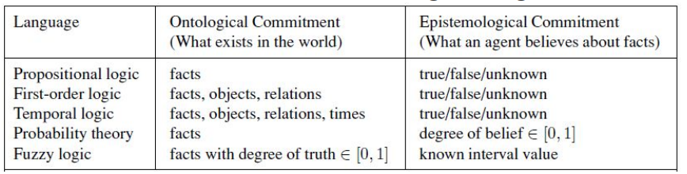
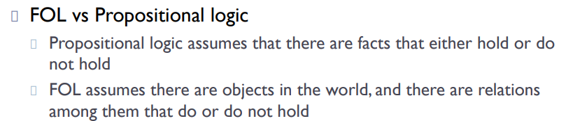
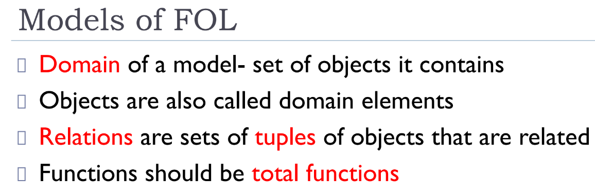
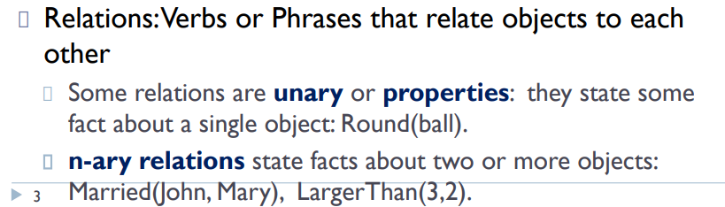
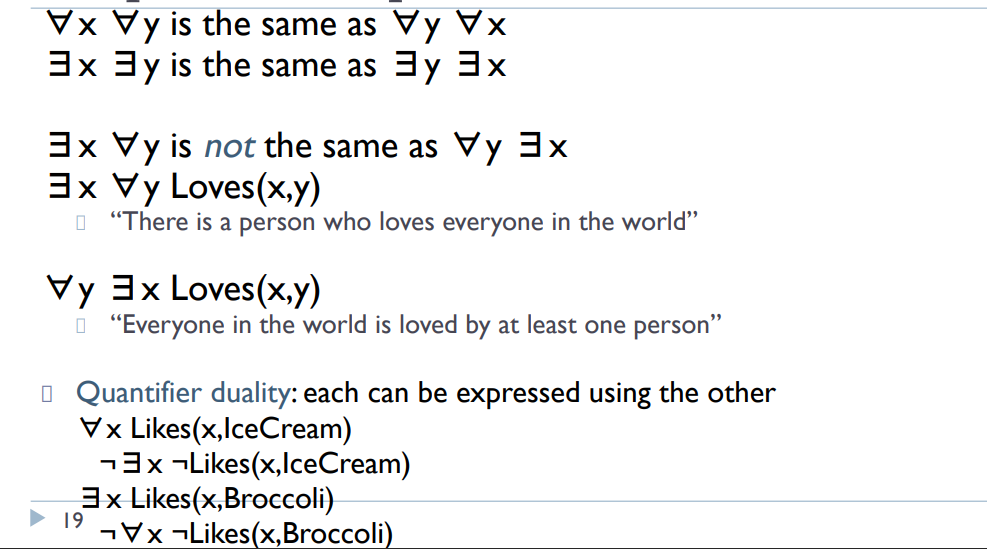
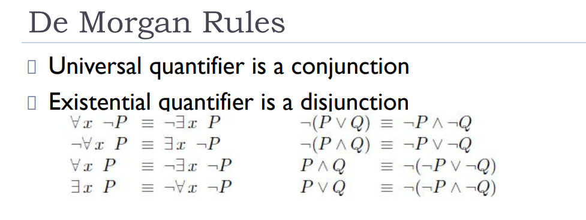

### types of logics and their aspects

# 			      <u>First-Order Logic</u>

First-order logic (FOL), also known as predicate logic or first-order predicate calculus, is a powerful framework used in various fields such as mathematics, philosophy, linguistics, and computer science. In artificial intelligence (AI), FOL plays a crucial role in knowledge representation, automated reasoning, and natural language processing.

## Fundamentals of First-Order Logic

[First-order logic](https://www.geeksforgeeks.org/propositional-and-first-order-logic-gq) extends [propositional logic](https://www.geeksforgeeks.org/proposition-logic) by incorporating quantifiers and predicates, allowing for more expressive statements about the world. The key components of FOL include constants, variables, predicates, functions, quantifiers, and logical connectives.

> 
>
> objects : constants, Variables

1. <mark>Constants</mark>: Constants represent specific objects within the domain of discourse. For example, in a given domain, `Alice`, `2`, and `NewYork` could be constants.

2. <mark>Variables</mark>: Variables stand for unspecified objects in the domain. Commonly used symbols for variables include `x`, `y`, and `z`.

   <u>Equality</u>

   The expression term1=term2 is **true under a given interpretation** if both terms refer to the **same object** in the model.

   - Example: If term1 is the constant "Dan" and term2 is a variable x that also happens to refer to "Dan", then term1=term2 is true.
   - If term1 and term2 refer to different objects (e.g., "Dan" and "Richard"), then term1=term2 is false.

   

3. <mark>Predicates</mark>: Predicates are functions that return true or false, representing properties of objects or relationships between them. For example, `Likes(Alice, Bob)` indicates that Alice likes Bob, and `GreaterThan(x, 2)` means that `x` is greater than 2.

   

   
   
4. <mark>Functions</mark>: Functions map objects to other objects. For instance, `MotherOf(x)` might denote the mother of `x`. `Sqrt(x)`

   

5. <mark>Quantifiers</mark>: Quantifiers specify the scope of variables. The two main quantifiers are:

   - **Universal Quantifier (∀)**: Indicates that a predicate applies to all elements in the domain.
     - For example, `∀x (Person(x) → Mortal(x))` means “All persons are mortal.”
   - **Existential Quantifier (∃)**: Indicates that there is at least one element in the domain for which the predicate holds.
     - For example, `∃x (Person(x) ∧ Likes(x, IceCream))` means “There exists a person who likes ice cream.”
       

6. <mark>Logical Connectives</mark>: Logical connectives include conjunction (∧), disjunction (∨), implication (→), biconditional (↔), and negation (¬). These connectives are used to form complex logical statements.

#### <u>Quantifiers</u>

> [!TIP]
>
> ### 1.Universal Quantification:
>
> Universal quantification asserts that a statement is true for **all possible objects** within a domain. The structure is:
> $$
> ∀x P(x)
> $$
> This means that for **every** object x, the statement P(x) is true.
>
> ### Example:
>
> The sentence "Everyone at UoM is smart" can be written as:
> $$
> ∀x (At(x,UoM)⇒Smart(x))
> $$
> 
>
> This means that for every person x, if x is at UoM, then x is smart.
>
> ### Interpretation:
>
> To interpret this in a model, for each individual in the domain, we check if the condition holds. For instance, if our domain consists of Dan, Richard, and Ben, the universal quantification translates to:
> $$
> (At(Dan,UoM)⇒Smart(Dan)) ∧ (At(Richard,UoM)⇒Smart(Richard)) ∧ (At(Ben,UoM)⇒Smart(Ben)) ∧…
> $$
> 
>
> ### Common Mistake to Avoid:
>
> Common mistake: using ∧ as the main connective with ∀: 
> $$
> ∀x At(x, UoM) ∧ Smart(x)
> $$
> means “Everyone is at UoM and everyone is smart” <mark>Leads to overly strong statements</mark>

> [!TIP]
>
> ### **2. Existential Quantification:**
>
> **Existential quantification** asserts that there exists **at least one** object in the domain for which a given statement holds. The general form of existential quantification is:
> $$
> ∃x P(x)
> $$
> This means that **there exists some object** x for which P(x) is true.
>
> ### **Example:**
>
> The statement "Someone at UoM is smart" can be written as:
> $$
> ∃x (At(x,UoM) ∧ Smart(x))
> $$
> This means that there is **at least one person** x such that x is at UoM and x is smart.
>
> ### **Interpretation:**
>
> For an existentially quantified statement to be true, we only need to find **one instance** in the domain where the statement holds. In our example, we just need to find one individual at UoM who is smart to make the statement true.
>
> If the domain consists of Dan, Richard, and Ben, the existential quantification translates to:
> $$
> (At(Dan,UoM) ∧ Smart(Dan)) ∨ (At(Richard,UoM) ∧ Smart(Richard)) ∨ (At(Ben,UoM) ∧ Smart(Ben)) ∨…
> $$
> As long as **one** of these conjunctions is true, the entire statement is true.
>
> ### Common Mistake to Avoid:
>
> Typically, ∧ is the main connective with ∃.
>
> Common mistake: using ⇒ as the main connective  with ∃:
> $$
> ∃x At(x, UoM) ⇒ Smart(x)
> $$
> <mark> is true even for someone who is not at UoM!</mark>

##### properties of quantifiers

## Syntax and Semantics of First-Order Logic

The syntax of first-order logic specifies the rules for constructing valid expressions, including terms and formulas. Terms are expressions that refer to objects and include constants, variables, and functions. Formulas are logical statements formed by combining predicates, terms, quantifiers, and logical connectives.

The semantics of FOL define the meaning of the expressions. An interpretation assigns a domain of discourse and provides meaning to the constants, functions, and predicates. A formula is considered true under an interpretation if it accurately describes the relationships and properties of the objects in the domain.

> For instance, in the domain of natural numbers, let `GreaterThan(x, y)` be a predicate that holds if `x` is greater than `y`. If `x` is assigned the value 5 and `y` is assigned the value 3, then `GreaterThan(5, 3)` would be true under this interpretation.

## Example: Using First-Order Logic for Reasoning

To illustrate the use of FOL in reasoning, consider the following knowledge base:

1. ∀x (Cat(x) → Mammal(x)) (All cats are mammals)
2. ∀x (Mammal(x) → Animal(x)) (All mammals are animals)
3. Cat(Tom) (Tom is a cat)

From these statements, we can infer:

1. Mammal(Tom) (Since Tom is a cat, and all cats are mammals)
2. Animal(Tom) (Since Tom is a mammal, and all mammals are animals)

These inferences demonstrate how FOL can be used to derive new knowledge from existing facts. The ability to reason logically about relationships and properties is a key strength of FOL in AI.

## Advanced Concepts in First-Order Logic

1. Unification: Unification is the process of finding a substitution that makes two logical expressions identical. It is a fundamental operation in automated reasoning and logic programming, enabling the matching of predicates with variables.
2. Resolution: Resolution is a rule of inference used for automated theorem proving. It involves refuting a set of clauses by deriving a contradiction, proving that the original statement is true. Resolution is a powerful method for proving logical theorems in FOL.
3. Model Checking: Model checking is a technique used to verify the correctness of systems with respect to a given specification. FOL is used to express the properties and behaviors of the system, enabling the verification of complex systems such as software, hardware, and protocols.
4. Logic Programming: Logic programming languages, such as Prolog, use FOL to express programs. These languages allow for declarative programming, where the programmer specifies what needs to be done rather than how to do it. Logic programming is used in various AI applications, including natural language processing, expert systems, and knowledge representa

## Applications of First-Order Logic in AI

First-order logic is instrumental in various AI applications, enabling systems to reason about complex knowledge structures and make informed decisions. Some of the key applications of FOL in AI include:

1. **Knowledge Representation**: FOL provides a robust framework for representing complex relationships and properties of objects. For example, in a medical diagnosis system, predicates can represent symptoms, diseases, and their relationships, allowing the system to reason about potential diagnoses.
2. **Automated Theorem Proving**: Automated theorem proving involves using algorithms to prove mathematical theorems. FOL provides the foundational structure for many theorem proving systems, enabling them to verify software and hardware correctness, prove mathematical theorems, and more.
3. Natural Language Processing (NLP): In NLP, FOL is used to parse and understand natural language by representing the meaning of sentences in a formal, logical manner. This allows AI systems to perform tasks such as question answering, machine translation, and text summarization.
4. Expert Systems: Expert systems encode expert knowledge using FOL and reason about it to make decisions. For example, a legal expert system might use FOL to represent legal rules and infer outcomes based on given facts, aiding in legal decision-making processes.
5. Semantic Web: The Semantic Web uses FOL to describe relationships between web resources, enabling more intelligent information retrieval and processing. This enhances the ability of AI systems to understand and interact with web content.

## Challenges and Limitations

Despite its power and expressiveness, FOL has some limitations and challenges:

1. ***\*Computational Complexity\****: Reasoning in FOL can be computationally expensive, particularly for large knowledge bases. Finding efficient algorithms for reasoning in FOL is an ongoing research area in AI.
2. ***\*Expressiveness vs. Decidability\****: While FOL is more expressive than propositional logic, it is also undecidable, meaning there is no general algorithm that can determine the truth of all FOL statements. This trade-off between expressiveness and decidability is a key consideration in AI.
3. ***\*Handling Uncertainty\****: FOL is not well-suited for handling uncertainty and probabilistic reasoning, which are common in real-world AI applications. Extensions to FOL, such as probabilistic logic and fuzzy logic, have been developed to address these limitations.