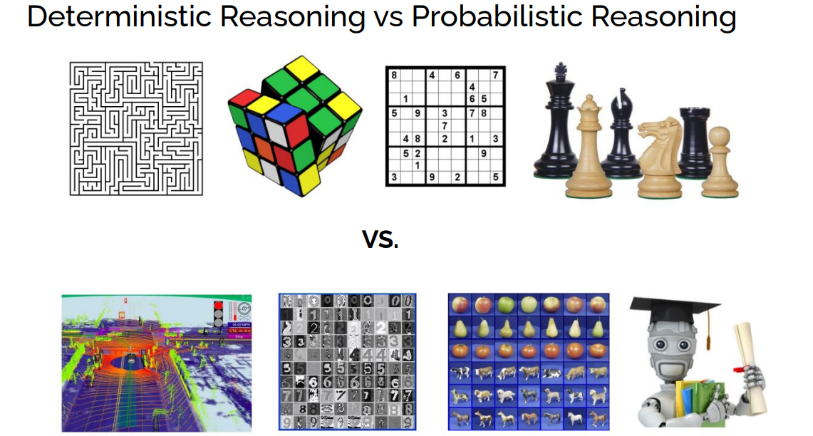
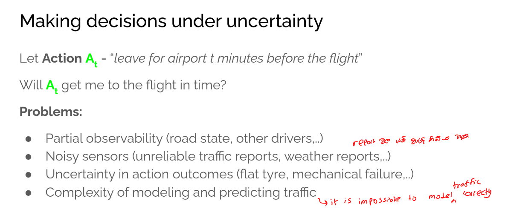
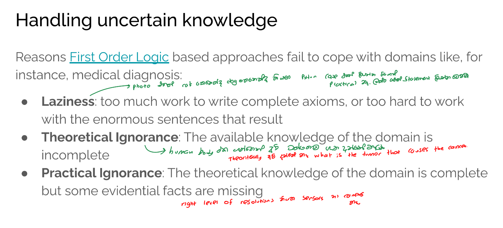
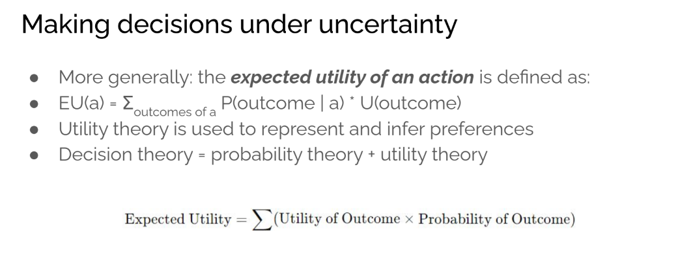

# Probabilistic reasoning 

## Uncertainty:

Till now, we have learned knowledge representation using first-order logic and propositional logic with certainty, which means we were sure about the predicates. With this knowledge representation, we might write A→B, which means if A is true then B is true, but consider a situation where we are not sure about whether A is true or not then we cannot express this statement, this situation is called uncertainty.

So to represent uncertain knowledge, where we are not sure about the predicates, we need uncertain reasoning or probabilistic reasoning.

## Causes of uncertainty:

Following are some leading causes of uncertainty to occur in the real world.

1. Information occurred from unreliable sources.

2. Experimental Errors

3. Equipment fault

4. Temperature variation

5. Climate change.

   

## Probabilistic reasoning:

Probabilistic reasoning is a way of knowledge representation where we apply the concept of probability to indicate the uncertainty in knowledge. In probabilistic reasoning, we combine probability theory with logic to handle the uncertainty.

We use probability in probabilistic reasoning because it provides a way to handle the uncertainty that is the result of someone's <mark>laziness and ignorance</mark>.

In the real world, there are lots of scenarios, where the certainty of something is not confirmed, such as "It will rain today," "behavior of someone for some situations," "A match between two teams or two players." These are probable sentences for which we can assume that it will happen but not sure about it, so here we use probabilistic reasoning.

**Need of probabilistic reasoning in AI:**

- When there are unpredictable outcomes.
- When specifications or possibilities of predicates becomes too large to handle.
- When an unknown error occurs during an experiment.

In probabilistic reasoning, there are few ways to solve problems with uncertain knowledge:

- **Bayes' rule**
- **Bayesian Networks**
- **Markov Models**

------

## Making decisions under uncertainty

------

# Probability

Terms: Prior probability = unconditional probability

### Product Rule:

The product rule allows us to express the joint probability P(A,B) in terms of conditional probabilities: 
$$
P(A,B)=P(A∣B)P(B)
$$
This formula shows that the probability of two events A and B both happening can be broken down into a conditional probability of one event happening given the other, multiplied by the probability of the second event.

### Chain Rule:

The chain rule is an extension of the product rule to more than two variables. It allows us to express the joint probability of a set of events
$$
P(X1,X2,...,Xn)
$$
as a product of conditional probabilities:
$$
P(X1,...,Xn)=P(Xn∣Xn−1,...,X1)P(Xn−1∣Xn−2,...,X1)⋯P(X2∣X1)P(X1)
$$
The chain rule breaks down the joint probability into successive conditional probabilities. It effectively captures the dependencies among the variables, where each variable's probability depends on the previous ones.

The formula at the bottom of the image represents the chain rule in a compact form:
$$
P(X1,...,Xn)=∏i=1nP(Xi∣Xi−1,...,X1)P(X_1, ..., X_n)
$$
This product notation indicates that the joint probability is obtained by multiplying all the conditional probabilities in the chain.

### Normalization : 

#### what to do with hidden variables

### Independence

#### 1. Absolute independence

#### 2. Conditional independence

Dentistry is a large field with hundreds of variables, none of which are  independent. What to do?

### Baye's Rule

**Example-1:**

**Question: what is the probability that a patient has diseases meningitis with a stiff neck?**

**Given Data:**

A doctor is aware that disease meningitis causes a patient to have a stiff neck, and it occurs 80% of the time. He is also aware of some more facts, which are given as follows:

- The Known probability that a patient has meningitis disease is 1/30,000.
- The Known probability that a patient has a stiff neck is 2%.

Let a be the proposition that patient has stiff neck and b be the proposition that patient has meningitis. , so we can calculate the following as:

P(a|b) = 0.8

P(b) = 1/30000

P(a)= .02

Hence, we can assume that 1 patient out of 750 patients has meningitis disease with a stiff neck.