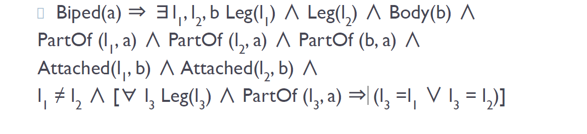
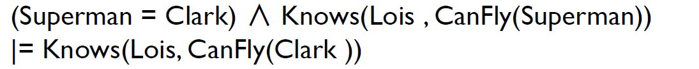

# <u>Knowledge Representation</u>

- Knowledge representation is the process of **encoding information about the world in a form that a computer system can understand and reason with**. This allows intelligent agents (computer programs) to perform tasks that require knowledge.

  

## <u>Key Aspects of Knowledge Representation</u>

### <u>Ontological Engineering</u>

- This involves defining the concepts and relationships that exist in an agent's environment.

- It is not feasible or necessary to represent everything in the world. Instead, a **upper (general) ontology** is created with placeholders for specific details.

  - Ex. Describe what a ‘physical object’ is. Specific details of specific objects such as television, book, tree,… can be described later.

  

  #### <u>Upper Ontology of the world</u>

## <u>Categories and Objects</u>

- <mark>Objects are organized into categories, and much reasoning occurs at the level of categories.</mark>

  - For example, the category 'dogs`has certain properties (e.g., they bark, have fur) that allow agents to identify and reason about individual dogs. These relationships can be represented in First-Order Logic (FOL).

- Agents can,

  > මේ තුන පිළිවෙළට සිදුවේ.
  >
  > 1. **Inferring the presence of objects from perceptual input.**  (input එක අනුව මේ මොන object එකක්ද කියල infer කිරීමේ හැකියාව ඇත.)
  >
  >    - For instance, an agent might see a round, orange object and infer that it is a basketball.
  >
  >      
  >      
  >
  > 2. **Inferring category membership from perceived properties.** (අවබෝධ කරගත් properties අනුව ඒක මොන category එකට අයිති එකක්ද කියලා infer කිරීමේ හැකියාව ඇත.)
  >
  >    - For example, an agent might see a creature with four legs, fur, and a wagging tail and infer that it is a dog. 
  >
  >      
  >      
  >
  > 3. **Using category information to make predictions about objects.** (Category එක ගැන දන්න තොරතුරු මත අනුමාන ලබා දීමේ හැකියාව ඇත.)
  >
  >    - For instance, knowing that a dog is a mammal, an agent might predict that it gives birth to live young. 

#### <u>FOL Facts about Categories and Objects</u>

**First-Order Logic (FOL)** provides a robust framework for representing these categories and objects. In FOL, **predicates** are used to define categories, such as "``Basketball(b)``," signifying that `b`is a basketball. **Objects** are then defined as members of these categories using statements like "Member(b, Basketballs)," which indicates that the object `b`belongs to the category 'Basketballs'

Taxonomies and Inheritance

 

**inheritance**, which allows categories to be organized hierarchically into a structure called a **taxonomy**.2 A taxonomy is essentially a classification system where more general categories branch out into more specialized subcategories. For example, 'Food`is a general category that encompasses the subcategory 'Fruit', and 'Fruit`further encompasses the subcategory 'Apple'. This hierarchical structure allows an agent to efficiently inherit properties from higher-level categories. For example, if an agent knows that 'Apple`is a subcategory of 'Fruit`and that all 'Fruit`is edible, it can infer that 'Apple`is also edible.

- FOL can be used to express various facts about categories and objects, such as:

- FOL can represent relationships like:
  - Beyond the relationships between categories and their members, the sources delve into relationships between categories themselves: 

●**Exhaustive Decomposition:** "ExhaustiveDecomposition({Americans, Canadians, Mexicans}, NorthAmericans)," indicating that any given North American <mark>must belong to at least one of the categories</mark>: American, Canadian, or Mexican

●**Partition:** A partition is a special case where the categories are both disjoint and exhaustively decompose a larger set. This means <mark>each object belongs to exactly one of the categories</mark>. The example provided is "Partition({Males, Females}, Animals)," signifying that any animal must be either male or female, but not both.

<u>Physical Composition</u>

- FOL can express that one object is part of another using the `PartOf` relation, which is transitive and reflexive.
- This allows for the representation of complex objects.

- `PartOf` relation is transitive and reflexive.
- `X` is part of `Y` and `Y` is part of `Z`. Then, `X` is part of `Z`.

- Composite object categories can be characterized by structural relations among parts.

  - A **biped** is an organism or entity that uses two legs for walking. 

  - The structural composition of a biped in terms of its parts (two legs and a body) and the relationships between these parts

    

    **Biped Definition (Biped(a))**:

    - The statement starts with `Biped(a)`, which signifies that `a` is a biped. The right side of the implication (`⇒`) defines the conditions for an object `a` to be considered a biped.

    **Existence of Legs and Body**:

    - `∃ l₁, l₂, b` specifies that there exist two legs, `l₁` and `l₂`, and a body, `b`.
    - `Leg(l₁) ∧ Leg(l₂) ∧ Body(b)`: This indicates that `l₁` and `l₂` are legs, and `b` is a body.

    **Part-of Relationships**:

    - `PartOf(l₁, a) ∧ PartOf(l₂, a) ∧ PartOf(b, a)`: This denotes that `l₁`, `l₂`, and `b` are parts of `a`, the biped.

    **Attachment Relations**:

    - `Attached(l₁, b) ∧ Attached(l₂, b)`: This specifies that both legs (`l₁` and `l₂`) are attached to the body `b`.

    **Uniqueness of Legs**:

    - `l₁ ≠ l₂`: This condition ensures that `l₁` and `l₂` are distinct, meaning they are two different legs.

    **Exclusivity Condition for Legs**:

    - `[∀ l₃ (Leg(l₃) ∧ PartOf(l₃, a) ⇒ (l₃ = l₁ ∨ l₃ = l₂))]`: This states that any leg `l₃` that is part of `a` must be either `l₁` or `l₂`. This enforces that `a` has exactly two legs.

- **<mark>PartPartition</mark>** refers to the way an object is divided into its component parts, based on the relationships between those parts.
- It defines how an object can be structurally decomposed into meaningful subcomponents or segments, which, when assembled together, form the complete object.
  - In the context of the slide, **PartPartition** specifies that a composite object (like a biped) is made up of certain parts organized in a specific structure. For example, a biped's **PartPartition** includes:
    - **Two legs** and **one body**.
    - Specific relations (like **attachment**) that indicate how these parts connect.

​	

## <u>Measurements and objects</u>

## <u>Substances and Objects</u>

- `things` (count nouns like 'cat') and `stuff` (mass nouns like 'butter'). 

- Substances are defined by intrinsic properties (e.g., color, melting point), while objects can have extrinsic properties (e.g., height, shape) that change upon subdivision.
- Extrinsic – properties of objects. Not retained under subdivision.

1. things :arrow_forward: objects :arrow_forward:count nouns :arrow_forward:extrinsic properties :cat2:
2. stuff :arrow_forward:substance :arrow_forward:mass nouns :arrow_forward:intrinsic properties :chestnut:

> ## A Concise Summary of "Things" vs. "Stuff"
>
> The distinction between "**things**" and "**stuff**" in knowledge representation hinges on the difference between **count nouns** and **mass nouns**. **Count nouns** represent discrete, countable objects like cats or cars, while **mass nouns** represent continuous, indivisible substances like butter or water.
>
> The sources use the terms "**thing**" and "**stuff**" somewhat interchangeably, with "thing" serving as the most general category for discrete objects. Similarly, "**stuff**" represents the most general category for substances.
>
> Objects (things) are often characterized by their **extrinsic properties**, which are specific to individual instances and can change upon subdivision, like the height or weight of a cat.
>
> In contrast, substances are defined primarily by **intrinsic properties**, which are inherent to the substance itself and remain consistent regardless of subdivision, like the color or melting point of butter.
>
> Representing "stuff" in a knowledge base can be tricky because it lacks distinct units for counting. One approach mentioned is to use logical statements that convey the idea that any part of a substance retains the same properties as the whole. For instance, any portion of butter is still considered butter.
>
> 

## <u>Time and Event Calculus</u>

The sources introduce the concept of **Time and Event Calculus** as a method for representing actions and changes that occur over time within a knowledge base.  This approach recognizes that many aspects of the world are dynamic and require a way to track how things change over time.

<u>Actions and Fluents</u>

- **Actions:** Represented as logical terms that describe an activity or event, such as "Forward" or "Turn(Right)." These actions often need to specify which agent is performing them. For example, "Forward(Robot1)" would indicate that Robot1 is moving forward.
- **Fluents:** <mark>Functions and predicates that can vary over time.</mark> These represent the state of the world and can change as a result of actions. The opposite of a fluent is an atemporal (eternal) predicate or function, which remains constant. An example of a fluent is "`At(Shiva, Colombo)`," indicating Shiva's location, which can change over time. "`Gold(G1)`" would be an atemporal predicate if G1 is always gold.

<u>Event Calculus: Handling Complex Scenarios</u>

When dealing with multiple agents, actions that have duration, and the possibility of actions overlapping in time, the sources recommend using **`Event Calculus`**. This approach provides a more sophisticated way to model dynamic situations.

**Event Calculus** relies on the following key ideas:

- <mark>T</mark>: **Fluents hold at points in time:**  This means that a fluent is either true or false at a specific moment. 

  ​						  	For example,
  $$
  T(At(Shiva, Colombo), t)
  $$
   							indicates that Shiva is at Colombo at time ``'t'``.
  

- **Reasoning occurs over intervals:**  Instead of just focusing on individual points in time, Event Calculus allows reasoning about what happens during periods. The sources extend the "T" predicate to work with intervals:                 
  $$
  T(f, (t1, t2)) ⇔ [∀ t (t1 ≤ t < t2) ⇒ T(f, t)]
  $$
   This means a fluent `f` holds over an interval (t1, t2) if it's true for all points` within that interval.

- **Events as instances of categories:**  Events, like actions, can be grouped into categories.                                                       "``E1 ∈ Flyings(Shiva, Colombo, Jaffna)``" categorizes event E1 as a flight taken by Shiva from Colombo to Jaffna.

  

> ### Examples of Event Calculus Predicates
>
> The sources provide a set of predicates used in event calculus to represent and reason about actions and changes over time. Here are some examples of these predicates, along with explanations and illustrative scenarios:
>
> - **`T(f, t)`**
>   - This predicate asserts that a fluent 'f`is **true** at a specific time 't'.
>   - *Example:* `T(At(Shiva, Colombo), 10:00AM)` would mean that the fluent 'At(Shiva, Colombo)`(meaning Shiva is at Colombo) is true at 10:00 AM.
> - **`Happens(e, i)`**
>   - This predicate indicates that an event 'e`occurs over a time interval 'i'.
>   - *Example:*  `Happens(Fly(Plane1, London, Paris), (1:00PM, 3:00PM))` means that the event 'Fly(Plane1, London, Paris)`(Plane1 flying from London to Paris) takes place between 1:00 PM and 3:00 PM.
> - **`Initiates(e, f, t)`**
>   - This predicate signifies that an event `e`**causes** a fluent 'f`to **start** being true at time 't'.
>   - *Example:* `Initiates(TurnOn(LightSwitch), Lit(Room), 7:00PM)` means that the event of turning on the light switch causes the room to become lit at 7:00 PM.
> - **`Terminates(e, f, t)`**
>   - This predicate means that an event `e`**causes** a fluent 'f`to **stop** being true at time 't'.
>   - *Example:* `Terminates(Close(Door), Open(Door), 10:30PM)` indicates that closing the door causes the fluent 'Open(Door)`to become false at 10:30 PM.
> - **`Clipped(f, i)`**
>   - This predicate asserts that a fluent 'f`**ceases(නවතියි) to be true** at some point during the time interval 'i'.  It doesn't specify the exact time when the fluent becomes false, just that it happens sometime within the interval.
>   - *Example:*  `Clipped(Playing(Movie), (8:00PM, 10:00PM))`  means that the movie stopped playing at some point between 8:00 PM and 10:00 PM. We don't know the precise moment it stopped.
> - **`Restored(f, i)`**
>   - This predicate states that a fluent `f` **becomes true** again at some point during the time interval 'i'. Similar to `Clipped`, the exact time within the interval when the fluent becomes true is not specified.
>   - *Example:* `Restored(Connected(Internet), (11:00AM, 1:00PM))` implies that the internet connection was restored sometime between 11:00 AM and 1:00 PM.
>
> The sources further provide axioms that define relationships between these predicates. These axioms allow for reasoning about how events affect the truth of fluents over time. 

> 
>
> ### Intervals: Moments and Extended Intervals
>
> The sources further discuss the representation of time intervals, distinguishing between two types:
>
> - **Moments:** Intervals with zero duration, representing points on a time scale.
> - **Extended intervals:** Intervals with non-zero duration.
>
> The sources categorize these intervals: "Partition({Moments,ExtendedIntervals}, Intervals)".
>
> They also define functions related to intervals:
>
> - **Time:** Maps a moment to its corresponding point on the time scale.
> - **Begin:** Returns the earliest moment within an interval.
> - **End:** Returns the latest moment within an interval.
> - **Duration:**  Calculates the difference between the end and start time of an interval.
>
> ### Allen's Interval Relations
>
> Finally, the sources mention **Allen's Interval Relations**, which provide a comprehensive set of relationships that can exist between time intervals. These relations include:
>
> - **Meet:**  Interval `i` ends at the same time interval  `j` begins.
> - **Before:** Interval `i` ends before interval `j`begins.
> - **After:**  The reverse of "Before."
> - **During:**  Interval `i`is fully contained within interval `j`.
> - **Overlap:** Intervals `i`and `j`partially overlap.
> - **Begins:** Interval `i`starts at the same time as interval `j`.
> - **Finishes:** Interval `i`ends at the same time as interval `j`.
> - **Equals:** Intervals `i`and `j`have the same start and end times.
>
> These relations provide a powerful tool for reasoning about temporal relationships between events and intervals.

## <u>Processes: "Liquid" Events</u>

- The sources also differentiate between discrete events and **processes**, sometimes referred to as "liquid events." Processes, unlike discrete events, have the property that any subinterval of a process is also a member of the same process category.
- This distinction is analogous to the "things" versus "stuff" contrast discussed earlier. Just as substances ("stuff") can be subdivided while retaining their properties, processes can be divided into smaller time intervals, and each subinterval still represents the same process.

**Key Property of Processes:** 

- The defining feature of a process is that any subinterval within its duration is also considered part of the same process category.

  - if "walking" is a process occurring between times *t1* and *t4*, then any interval within that period, say between *t2* and *t3*, would also be classified as "walking". This contrasts with discrete events, which are seen as singular occurrences.

  

**Significance in Knowledge Representation:** 

- Many real-world actions are better understood as ongoing processes rather than isolated events. 
  - "learning," "growing," or "eroding (ඛාදනය වීම)." : representing such actions as processes might allow AI systems to reason about their ongoing nature, predict their development over time, and understand their effects in a more nuanced        ( සියුම් ) way.

## <u>Intervals</u>

- **Two Types of Intervals:** moments and extended intervals.

  - Moments have zero duration, representing points in time. 

  - Extended intervals, on the other hand, have a non-zero duration.

  - This distinction is formalized using a partition:

    

  -  `{Moments, ExtendedIntervals}` constitutes a complete and mutually exclusive division of all intervals.

- Moments are conceptualized as points on a time scale. The function <mark>Time</mark> maps a given moment to its corresponding point on the time scale.

- **Defining Characteristics of Intervals:** For extended intervals, several functions are defined:

  - functions related to intervals:
    - **`Time`:** Maps a moment to its corresponding point on the time scale.
    - `Begin`: Returns the earliest moment within an interval.
    - **`End`:** Returns the latest moment within an interval.
    - **`Duration`:**  Calculates the difference between the end and start time of an interval.

## <u>Mental Events and Mental Objects</u>

- To represent the knowledge and reasoning processes of agents, we need to model `mental objects (beliefs, knowledge)` and `mental processes (deductions, inferences)`. 

-  It examines how people relate to the ideas or propositions they hold in their minds.

- This involves concepts like:

  - `Propositional Attitudes`:

    - Relationships between agents and mental objects, such as 'Believes', 'Knows', 'Wants'.
    - Mental states that reflect an agent's attitude toward a specific proposition.

    

  

  - propositional attitudes like believes and knows, have referential opacity.
  - `Referential Opacity`: The fact that the truth of a statement about an agent's belief does not depend solely on the truth of the statement itself.