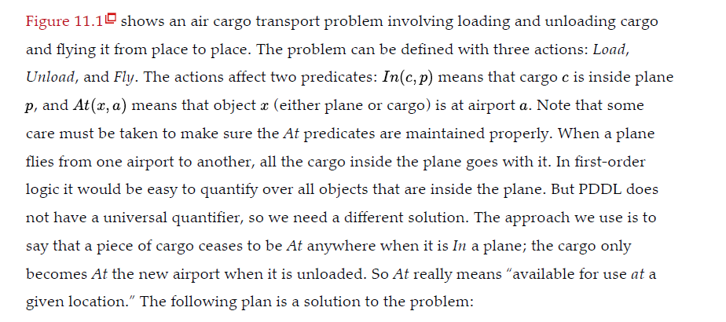
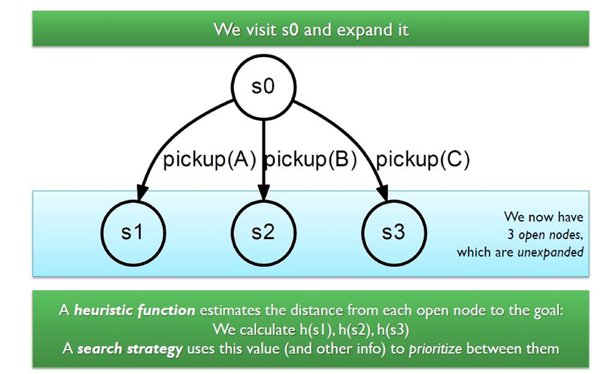

# <u>Planning</u>


## <u>Introduction To Planning</u>

- Up to this, we talked about reactive agents. They react to the percepts that is obtained from the environment accordingly.
- They are not planning.

### <u>What is Planning?</u>

- Given the current state and the state of the world you want to achieve (goals),
  - determine how (and when) to do it (plan).
  - I.e. Figuring out a sequence of actions to achieve the goal.
- We will restrict this discussion to **deterministic**, **fully observable**, **static** and **discrete** situations which is known as Classical Planning.
  - Static => Changes occur only when the agent act.
- <mark>Classical planning is defined as the task of finding a sequence of actions to accomplish a goal in a discrete, deterministic, static, fully observable environment.</mark>
- We have seen two approaches to this task:
  - the problem-solving agent of Chapter 3 and 
  - the hybrid propositional logical agent of Chapter 7.
- Both share two limitations. 
  - First, they both require **ad hoc heuristics** for each new domain: a heuristic evaluation function for search,
    and hand-written code for the hybrid wumpus agent.
  - Second, they both need to explicitly represent an exponentially large state space.
    - For example, in the propositional logic model of the Wumpus world, the axiom for moving a step forward had to be repeated for all four agent orientations.


### <u>A Planning Problem</u>

- **Goal**: Have a birthday party 
- Current state:
  - Agent is at home.
  - There is enough flour in the larder. But no butter or sugar.
- Things to do:
  - Invite friends
  - Make a cake
    - As a subplan, we should go to the shop and buy butter and sugar.


### <u>Planning Requirements</u>

- A way to express the planning problem.
- An algorithm to solve the problem.
- Planning algorithms based on logical approaches should take advantage of the logical structure of the problem.
  - For this, the problem should be expressed in a suitable logical language.
  - The language should be:
    - Expressive enough to describe a variety of problems.
    - Restrictive enough to let efficient algorithms to operate on it.
  - **Language should represent states, goals and actions.**


## <u>PDDL  (Planning Domain Definition Language)</u>

- In response to these limitations, planning researchers have invested in a factored representation using a family of languages called **PDDL(Planning Domain Definition Language).**
- Basic PDDL can handle classical planning domains, and extensions can handle non-classical domains that are
  continuous, partially observable, concurrent, and multi-agent. 

### <u>PDDL Syntax</u>

#### <u>State</u>

- <mark>A state is represented as a conjunction of **ground atomic fluents**</mark>. 

  - “ground” means no variables.

  - “fluent” means an aspect of the world that changes over time and

  - “ground atomic” means there is a single predicate, and if there are any arguments, they must be constants.

    

    - `Poor ∧ Unknown` could describe an individual's state as being both poor and in an unknown state.
    - `At(plane1, Sydney) ∧ At(plane2, Perth)` represents a state where `plane1` is in `Sydney` and `plane2` is in `Perth`.

    

    - `At(x, y)` is invalid because it uses variables (`x` and `y`).
    - `¬Poor` (negation) is invalid; PDDL does not allow negated literals in state descriptions.
    - `At(Spouse(Ali), Sydney)` is invalid because it uses a function symbol (`Spouse`).

  - **Closed-world assumption**: Whatever is not  mentioned is assumed to be false.

  - **Unique name assumption**: Plane1  != Plane2

#### <u>Goals</u>

- In planning and logic representation, a **partially specified state** refers to a state that includes only some aspects or conditions of the world, without specifying every detail.

  1. **Partially Specified State**:

     - This state includes only some facts or properties of the world.
     - For example:
       - `At(Plane1, Melbourne)` specifies only the location of `Plane1`, without mentioning other planes, people, or objects.
       - `Rich ∧ Famous` specifies only that the person is rich and famous, without stating anything about their happiness, health, etc.

  2. **Goal Satisfaction**:

     - A propositional state `s` is said to **satisfy a goal** `g` if s contains all the atoms (or conditions) of g.
     - In other words, `s` can contain additional information beyond what is specified in `g`, but it must include all of `g`'s conditions to satisfy the goal.

     

#### <u>Actions</u>

- Specified using an action schema containing:

  - **Preconditions**: must hold to execute the action.
  - **Effects**: changes caused by the action.

  

  - here;

    - In the preconditions, it contains the state which need for an action to be completed.
    - After flying from p, `At(p, from)`(delete list) is not a valid state in the state list. So it should be negated and then, new state is added to the list `At(p, to)`(add list).

     


- Another Example:
  - Action - go from Moratuwa to Piliyandala by bus.
  - Grand plan - get in to the bus, get tickets and go to the relevant destination.
  - Pre condition - you should be in the bus halt, check whether you have enough money in the pocket.
  - Effect - you are now at the Piliyandala bus stop. not in Moratuwa.


### <u>PDDL Semantics</u>

- <mark>An action is applicable in any state that satisfies the precondition.</mark>
- How to establish applicability?


- Starting at state `s`, result of executing action `a` is a state  `s’`.

  - Contains (+) ve literals in the effect of a.
  - (-)ve literals are removed.
  - Otherwise same as `s` (effect of a  තුළ positive or negative literals  නැතිනම් මොකුත් වෙලා නැහැ නේ).

-  **Assumption**: every literal not mentioned in the effect  remains unchanged.

  - Avoids frame problem.

    

#### <u>Frame Problem</u>

- The frame problem addresses how to deal with the large number of facts that do not change after an action. For every action, only a few specific facts (fluents) are modified, but many others remain the same.
  - For example, if a plane moves from Sydney to Perth, unrelated facts such as the location of another plane or the fact that it is raining in Melbourne would remain unchanged.
- Without a solution to the frame problem, every action would require specifying both the changes it causes and a complete list of the facts that remain the same. This becomes impractical in complex systems with numerous actions and facts.


## <u>ADL (Action Description Language)</u>

- **ADL** (Action Description Language) is an extension of STRIPS and is a component of the PDDL (Planning Domain Definition Language) family.
- It was introduced to make planning languages more expressive and to handle more complex planning domains.
- Below is the same Action from STRIPS and ADL.

 1. Stripes                                  2. ADL 

- **Support for Negative Literals**:
  - Unlike STRIPS, ADL allows **negative literals** in both preconditions and effects, enabling more flexible goal and state descriptions.
- **Conditional Effects**:
  - ADL allows effects to be conditional, meaning certain effects of an action occur only if specific conditions are met.
  - This supports more complex actions where some effects depend on the state of the world.
- **Disjunctive Preconditions**:
  - ADL allows **disjunctions** (logical OR) in action preconditions, enabling actions that can occur under a variety of conditions.
- **Quantified Preconditions**:
  - ADL supports **quantifiers** (e.g., ∀ for "for all" and ∃ for "exists") in preconditions, allowing for more expressive statements about the state.
- **Closed-World Assumption and Unique Name Assumption**:
  - Like STRIPS and PDDL, ADL typically assumes a closed world (anything not stated is false) and unique names for each object.


## <u>STRIPS</u>

- **STRIPS** was one of the earliest planning languages, developed in the early 1970s to solve automated planning problems.
- It introduced a way to represent actions, states, and goals, focusing on simplicity and computational feasibility.

| Feature                  | STRIPS                                     | PDDL                                                         |
| ------------------------ | ------------------------------------------ | ------------------------------------------------------------ |
| **Expressiveness**       | Limited                                    | More expressive, with support for variables, types, and complex conditions |
| **State Representation** | Conjunction of ground atomic fluents       | Similar, but allows complex conditions                       |
| **Actions**              | Preconditions, add effects, delete effects | Preconditions and effects with negation, disjunction         |
| **Assumptions**          | Closed-world, unique name                  | Closed-world, unique name                                    |
| **Advanced Features**    | None                                       | Supports typing, hierarchy, temporal, and numeric planning   |
| **Negative Literals**    | Not supported                              | Supported                                                    |


## <u>Planning Problems</u>

### <u>Air Cargo</u>




> SFO is an airport , C1 is a cargo likewise we have to state all , otherwise with closed world assumption all the things that are not indicated will be assumed to be false. System will not be able to derive them itself because they are initial data.	 


###  <u>The Spare Tire Problem</u>


## <u>Planning Algorithms</u>

-  Use state-space search
  - Actions in a planning problem specify both preconditions and effects.
  - Search can be performed in either direction.
    - <mark>Forward state-space search => initial state to goal state</mark>
    - <mark>Backward state-space search => goal state to initial state</mark>
- Plan space search:
  - Partial order planning (POP)
-  State space search Possible because actions in a planning problem specify both preconditions and effects.
  - Nodes = states of the world
  - Transitions between nodes = actions.
  - Path through the state space = plan


### <u>Forward state-space search</u>

- Step cost is usually one per action. But it is easy to allow differential costs.
- As usual, the main issue with Forward search is that it cannot avoid irrelevant actions.
  - it explores all possible actions from a given state, even if many of those actions are irrelevant to reaching the goal.
  -  Thus it is inefficient. Need to use a good heuristic function to estimate distance from state to goal.
- Also called **progression planning**.
- Starting from the initial state, consider sequences of actions that reach the goal.
- For a given state, all actions whose preconditions are satisfied, are applicable.
- <mark>The successor state is determined by adding the positive effect literals and deleting the negative effect literals to the current state.</mark>
  - Plane travels from x to y. When it departs x, `At(plane1, x)` state is removed from the state list and `At(plane1, y)` new state is added to the state list.
- Goal test checks if the current state satisfies the goal.

#### <u>Algorithm</u>

```pseudocode
Forward-search(O, so, g)
	S <- S0
	π <- the empty plan
	loop
		if s satisfies g then return π
		applicable - {a | a is a ground instance of an operator in O,
							and precond(a) is true in s}
		if applicable = 0 then return failute
		nondeterministically choose an action a E applicable
		s <- y(s,a)
		π <- π.α
```


#### <u>Loop Checking</u>


#### <u>Branching Factor</u>

- Number of applicable plans that don’t  progress towards goal.
- <mark>Forward search has a large branching factor.</mark>
  - Example:– Blocks world

### <u>Blocks World Problem</u>


- Possible State Predicates

  - **Holding(a)**: The agent (or robot) is holding block `a`.

  - **handEmpty**: The agent's hand is empty (not holding any block).

  - **onTable(a)**: Block `a` is on the table.

  - **on(a, b)**: Block `a` is on top of block `b`.

  - **clear(a)**: Block `a` has no blocks on top of it, making it "clear."

- Possible Actions

  - **Pickup(a)**: Pick up block `a` from the table (precondition: `clear(a)` and `handEmpty`).

  - **Putdown(a)**: Put down block `a` onto the table (precondition: `Holding(a)`).

  - **Stack(a, b)**: Place block `a` on top of block `b` (precondition: `Holding(a)` and `clear(b)`).

  - **Unstack(a, b)**: Remove block `a` from on top of block `b` (precondition: `on(a, b)` and `clear(a)`).


- Here, we assume only block `a` exists. Then there is only two states reachable.
- But, when the size is increasing, due to high branch factor of forward state space algorithm, problem domain increases.


- Solution??
  - Domain-specific : search control rules, heuristics.
  - Domain-independent : heuristics automatically  generated from the problem description.


### <u>Heuristic</u>


#### <u>Example use of Heuristic in Block World Problem</u>





#### <u>Use of Heuristics</u>

- Two aspects of heuristic guidance.

  - Use a search strategy that can make use of heuristics (E.g. A*)
  - Generating the actual heuristic guidance.
    - Should be able to apply on the selected search strategy.
  - Heuristic function should be efficient.
  - Two distinct objectives for heuristic selection:

  

#### <u>Domain-Independent Heuristics</u>

- Decide how close a state s is to the goal.
  - Count how many facts are different.
- No action costs, for simplicity.
- Search strategy
  - Choose an open node with a minimal number of  goal facts to achieve.


### <u>Backward state-space search</u>

- Also called regression planning.

- Work backward from the `goal(s)`.

- Generates only relevant actions.

  - An action is relevant to a conjunctive goal, if it achieves one of the conjuncts of the goal.

  

- Actions must be chosen such that they are consistent with the goal.

  - Specifically, an action should not undo any desired literals that are part of the goal state.

  

***??????****???????????????


#### <u>Algorithm</u>

```pseudocode
Backward-search(O, so, g)
	π <- the empty plan
	loop
		if so satisfies g then return π
		applicable - {a | a is a ground instance of an operator in O
							that is relevant for g}
		if applicable = 0 then return failure
		nondeterministically choose an action a E applicable
		π <- a.π
		g <- y-1(g,a)
```

- Backward search can also have a very large branching factor.
- As before, deterministic implementations can waste lots of time trying all of them.